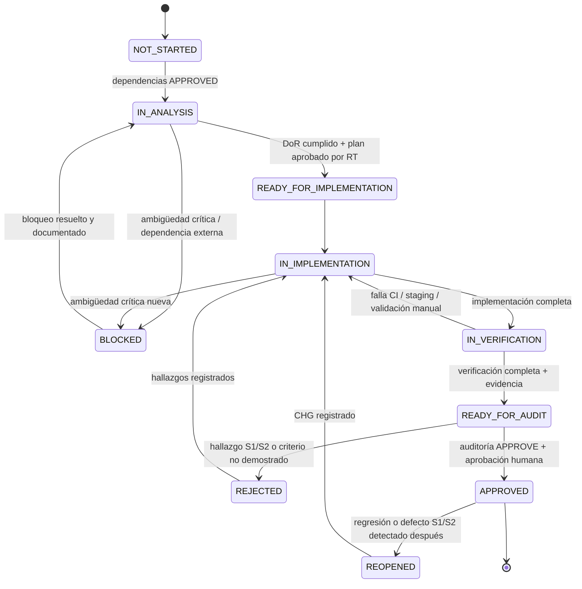
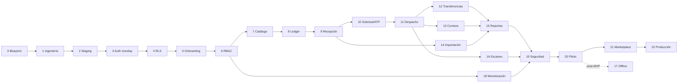

# Sistema de Ejecución Controlado para Claude Code

| Campo | Valor |
|---|---|
| **Proyecto** | WMS multi-tenant para monday.com Marketplace |
| **Documento** | Plan Maestro Ejecutable (`/docs/execution/master-plan.md`) |
| **Estado del documento** | Vigente — documento rector de la ejecución |
| **Propietario** | Responsable Técnico (Tech Lead) |
| **Revisión obligatoria** | Al cierre de cada fase y ante cualquier `CHG` aprobado |
| **Propósito** | Impedir que el proyecto avance por acumulación de código sin validación funcional, técnica, operativa y de seguridad demostrada. |

> **Cómo leer este documento.** Las Partes I y II son normativas: definen reglas que no se negocian por fase. La Parte III es el plan de fases. La Parte IV define cómo se prueba, se migra, se cambia y se evidencia. La Parte V contiene los prompts operativos para Claude Code. La Parte VI cubre operación, métricas y criterios de parada. Los anexos contienen plantillas listas para copiar.
>
> Las palabras **DEBE**, **NO DEBE**, **DEBERÍA** y **PUEDE** se usan con el sentido de RFC 2119: *DEBE* es obligatorio; *DEBERÍA* admite excepción solo con justificación registrada en un ADR o `CHG`.

---

# PARTE I — GOBIERNO DE LA EJECUCIÓN

## 1. Objetivo

Este documento transforma el blueprint del WMS en un sistema de ejecución controlado para Claude Code.

El objetivo no es completar código rápidamente. El objetivo es entregar, fase por fase, un producto que:

- cumpla las reglas reales del negocio;
- funcione en un entorno equivalente a producción;
- mantenga aislamiento estricto entre tenants;
- preserve integridad financiera y transaccional;
- aplique autorización y segregación de funciones desde el backend;
- cumpla objetivos de servicio (SLO), recuperación (RPO/RTO) y rendimiento definidos de antemano;
- produzca evidencia verificable y reproducible antes de aprobar cada fase;
- pueda ser auditado por una sesión independiente **y** por una persona responsable;
- no avance mientras existan hallazgos críticos o altos abiertos.

### 1.1 Supuesto de diseño sobre Claude Code

Claude Code es un implementador capaz pero **no es una fuente de verdad**: puede equivocarse, sobreestimar su progreso o reportar como ejecutado algo que no ejecutó. Todo este sistema está diseñado bajo ese supuesto:

- toda afirmación de éxito DEBE estar respaldada por salida real de comandos o por artefactos de CI;
- la evidencia que importa la genera la CI, no el implementador;
- una auditoría realizada por otra sesión del mismo modelo reduce errores pero **no** equivale a independencia real; por eso las fases críticas exigen revisión humana adicional (ver §3 y mapa de fases).

---

## 2. Principio rector

Cada fase sigue obligatoriamente este ciclo:

```text
Especificar → Analizar → Planificar → Implementar → Probar automáticamente
→ Desplegar en staging → Validar manualmente → Auditar independientemente
→ Registrar evidencia → Aprobar o rechazar (decisión humana)
```

Una fase **no** termina porque:

- el código compila;
- la interfaz se visualiza;
- los tests escritos por el implementador pasan;
- Claude Code afirma que terminó;
- el happy path funciona localmente;
- la CI está en verde pero nadie revisó qué prueba realmente.

Una fase termina únicamente cuando cada criterio de aceptación ha sido **demostrado con evidencia trazable** y el gate de cierre ha sido aprobado por el Responsable Técnico.

---

## 3. Roles y responsabilidades

| Rol | Quién | Responsabilidad | Restricción |
|---|---|---|---|
| **Product Owner (PO)** | Persona | Dueño de reglas de negocio, alcance, prioridades y aceptación funcional. Resuelve ambigüedades de negocio. | No aprueba gates técnicos en solitario. |
| **Responsable Técnico (RT)** | Persona | Dueño de arquitectura, ADR, gates y aprobación final de fase. Acepta riesgos residuales. | No puede ser el único revisor del código que él mismo escribió. |
| **Implementador** | Sesión de Claude Code (Sesión B) | Analiza, planifica e implementa la fase activa. Produce evidencia. | Nunca marca una fase `APPROVED`. Sin acceso a producción. |
| **Analista** | Sesión de Claude Code (Sesión A) | Produce análisis y plan de la fase. | No modifica código. |
| **Auditor IA** | Sesión nueva de Claude Code (Sesión C) | Auditoría adversarial independiente del contexto del implementador. | No implementa funcionalidad. |
| **Revisor humano de seguridad** | Persona (puede ser el RT o externo) | Revisión obligatoria en fases marcadas 🔒. | Distinto del autor del cambio. |
| **Validador manual (QA)** | Persona | Ejecuta el guion de validación en staging y firma PASS/FAIL. | No valida su propio desarrollo. |
| **Usuario piloto** | Cliente real | Valida que el sistema resuelve el trabajo operativo. | Solo en Fase 20 en adelante. |
| **Responsable de incidentes** | Persona | Coordina respuesta, comunicación y postmortem. | Definido antes de Fase 20. |

### 3.1 Matriz RACI por actividad

R = ejecuta · A = aprueba y rinde cuentas · C = consultado · I = informado

| Actividad | PO | RT | Implementador | Auditor IA | Rev. seguridad | QA |
|---|---|---|---|---|---|---|
| Especificación de fase | A | R | C | — | C | C |
| Resolución de ambigüedad de negocio | A/R | C | I | — | — | — |
| Resolución de ambigüedad técnica | C | A/R | C | — | C | — |
| Análisis y plan | I | A | R | — | — | — |
| Implementación | — | A | R | — | — | — |
| Auditoría | I | A | I | R | R (🔒) | — |
| Validación manual | C | I | — | — | — | R/A |
| Aceptación de riesgo residual | C | A | — | C | C | — |
| Aprobación de gate | C | A/R | — | C | C (🔒) | C |
| Migración en producción | I | A | R (prepara) | — | C | — |

---

## 4. Reglas absolutas de ejecución

Las reglas se agrupan por dominio y tienen identificador para poder citarlas en auditorías y hallazgos.

### 4.1 Alcance y flujo

- **R-01.** Claude Code trabaja una sola fase activa a la vez (WIP = 1 por implementador).
- **R-02.** La especificación aprobada de la fase activa es la fuente de verdad inmediata.
- **R-03.** No se implementan elementos de fases futuras por conveniencia, ni "preparaciones" no especificadas.
- **R-04.** Ninguna fase avanza automáticamente a la siguiente; el cambio de fase es una decisión humana.
- **R-05.** El cambio mínimo correcto tiene prioridad sobre una reescritura amplia.

### 4.2 Ambigüedad y decisiones

- **R-06.** No se inventan reglas de negocio para llenar vacíos.
- **R-07.** Una ambigüedad que afecte datos, dinero, inventario, seguridad, permisos, estados o contratos públicos **bloquea** la implementación.
- **R-08.** Durante el análisis, Claude Code enumera **todas** las ambigüedades bloqueantes en una sola entrega, numeradas y con opciones propuestas, y se detiene. Durante la implementación, ante una ambigüedad nueva, formula la pregunta concreta y se detiene. (Agrupar preguntas en el análisis evita ciclos innecesarios de ida y vuelta.)
- **R-09.** No se modifica la arquitectura sin causa técnica documentada en un ADR aprobado.
- **R-10.** No se reemplazan patrones existentes si pueden extenderse de forma segura.

### 4.3 Pruebas y verificación

- **R-11.** Toda funcionalidad crítica se prueba contra PostgreSQL real, de la misma versión mayor que producción.
- **R-12.** No se usan mocks para validar RLS, transacciones, locks, constraints, pooling o concurrencia.
- **R-13.** Ningún test puede eliminarse, debilitarse, omitirse o marcarse como `skip`/`only`/`todo` para obtener un resultado exitoso. Un test inestable (*flaky*) en una ruta crítica es un defecto bloqueante, no un ruido aceptable.
- **R-14.** Toda migración se prueba desde una base vacía y desde el estado anterior con datos representativos.
- **R-15.** Ningún resultado se reporta como ejecutado si no se ejecutó. "No ejecutado" o "no verificable en este entorno" es una respuesta válida; inventar salida es un hallazgo crítico.

### 4.4 Seguridad y entornos

- **R-16.** Producción nunca se utiliza como entorno de prueba, y Claude Code nunca tiene credenciales de producción.
- **R-17.** Ningún control de seguridad puede existir solamente en la interfaz.
- **R-18.** Datos de producción nunca se copian a entornos inferiores sin anonimización irreversible aprobada.
- **R-19.** Si una prueba de aislamiento entre tenants falla, se detiene el proyecto hasta corregirla (incidente S1, ver §6).

### 4.5 Aprobación y riesgo

- **R-20.** La persona o sesión que implementa nunca es la que aprueba.
- **R-21.** Todo riesgo residual queda documentado con dueño, severidad y fecha de revisión.
- **R-22.** Staging se mantiene tan cercano a producción como sea razonablemente posible; toda diferencia conocida se documenta en `/docs/architecture/deployment.md`.

---

## 5. Jerarquía de fuentes de verdad

Claude Code resuelve conflictos usando este orden:

1. Especificación aprobada de la fase activa.
2. Blueprint aprobado del producto.
3. ADR vigentes (`Aprobado`).
4. Reglas de negocio documentadas.
5. Matriz aprobada de roles, permisos y alcance.
6. Arquitectura documentada.
7. Contratos públicos existentes (API, esquemas, eventos).
8. Pruebas válidas existentes.
9. Implementación actual.

Reglas de aplicación:

- El código existente no prevalece sobre una regla aprobada si el código está equivocado; en ese caso se registra como defecto.
- **Un conflicto entre los niveles 1 a 5 no se resuelve eligiendo: se detiene la fase** y se escala al PO (negocio) o al RT (técnico). Si la fase activa contradice el blueprint, uno de los dos está mal y debe corregirse mediante `CHG`.
- La documentación oficial vigente de terceros (monday.com, PostgreSQL, proveedor de hosting) prevalece sobre la memoria del modelo. Claude Code DEBE verificar comportamiento de APIs externas contra documentación o prueba real, no contra suposiciones.

---

## 6. Taxonomía de severidad

Toda falla, hallazgo de auditoría o incidente se clasifica con esta tabla. Sin severidad acordada no hay gate.

| Severidad | Definición | Ejemplos | Efecto en el gate | Plazo de corrección |
|---|---|---|---|---|
| **Crítica (S1)** | Compromete aislamiento entre tenants, identidad, integridad del ledger, dinero o secretos; o es evidencia fabricada. | Lectura cruzada entre tenants; bypass de autenticación; `UPDATE` posible sobre el ledger; secreto en el bundle; reporte de tests que no se ejecutaron. | Rechazo automático. Detiene el proyecto si es de aislamiento. | Inmediato; nada más avanza. |
| **Alta (S2)** | Rompe autorización dentro del tenant, atomicidad, idempotencia, segregación de funciones o una regla de negocio crítica; o hay error silencioso en ruta crítica. | Usuario fuera de alcance aprueba; despacho duplicado por reintento; migración que bloquea tablas sin `lock_timeout`; `catch` que oculta fallo de escritura. | Rechazo automático. | Antes de re-auditar. |
| **Media (S3)** | Defecto funcional con alternativa segura, brecha de observabilidad, caso negativo no crítico sin cubrir. | Mensaje de error confuso; falta métrica; paginación inconsistente. | Puede aprobarse solo con aceptación explícita del RT, dueño y fecha. Máximo 3 abiertos por fase. | Fase siguiente o fecha acordada. |
| **Baja (S4)** | Estilo, documentación menor, mejora no funcional. | Nombre poco claro; typo en docs. | No bloquea. Se registra en backlog. | Sin plazo fijo. |

En caso de duda entre dos severidades, se asigna la más alta hasta que el RT la reclasifique por escrito.

---

## 7. Estados de una fase

```text
NOT_STARTED · IN_ANALYSIS · BLOCKED · READY_FOR_IMPLEMENTATION · IN_IMPLEMENTATION
IN_VERIFICATION · READY_FOR_AUDIT · REJECTED · APPROVED · REOPENED
```

### 7.1 Diagrama



### 7.2 Tabla de transiciones

| Desde | Hacia | Condición | Quién decide |
|---|---|---|---|
| `NOT_STARTED` | `IN_ANALYSIS` | Todas las dependencias en `APPROVED` | RT |
| `IN_ANALYSIS` | `BLOCKED` | Ambigüedad crítica o dependencia externa no resuelta | Analista (registra), RT (confirma) |
| `BLOCKED` | `IN_ANALYSIS` | Resolución documentada (respuesta del PO, ADR o `CHG`) | RT |
| `IN_ANALYSIS` | `READY_FOR_IMPLEMENTATION` | Definition of Ready completa y plan aprobado | RT |
| `IN_IMPLEMENTATION` | `IN_VERIFICATION` | Tareas del plan completadas | Implementador |
| `IN_VERIFICATION` | `IN_IMPLEMENTATION` | Cualquier verificación falla | Automático / Implementador |
| `IN_VERIFICATION` | `READY_FOR_AUDIT` | CI verde, staging desplegado, validación manual PASS, evidencia completa | Implementador propone, RT confirma |
| `READY_FOR_AUDIT` | `REJECTED` | Hallazgo S1/S2, criterio no demostrado o criterio de rechazo automático (§33) | Auditor / RT |
| `READY_FOR_AUDIT` | `APPROVED` | Auditoría APPROVE, revisión humana 🔒 si aplica, riesgos aceptados | **RT (exclusivo)** |
| `REJECTED` | `IN_IMPLEMENTATION` | Hallazgos registrados en `auditor-report.md` | RT |
| `APPROVED` | `REOPENED` | Regresión o defecto S1/S2 atribuible a la fase | RT |

Reglas adicionales:

- Solo puede iniciarse una fase cuyas dependencias estén en `APPROVED`. Una dependencia en `REOPENED` congela a sus dependientes en `BLOCKED` si el defecto los afecta.
- Toda transición se registra en `/docs/execution/phase-status.md` con fecha, actor, commit SHA y motivo (plantilla en Anexo D).
- Tres rechazos consecutivos de la misma fase obligan a una revisión de causa raíz del proceso (¿especificación deficiente?, ¿alcance excesivo?) antes del cuarto intento.

---

## 8. Definition of Ready (DoR)

Una fase solo pasa a `READY_FOR_IMPLEMENTATION` si cumple:

```text
Negocio
[ ] Objetivo de negocio definido y medible
[ ] Alcance incluido cerrado
[ ] Fuera de alcance explícito
[ ] Reglas de negocio numeradas (BR-xxx) y verificables
[ ] Estados y transiciones definidos (incluidas transiciones inválidas)
[ ] Criterios de aceptación en Given/When/Then con ID (AC-xx-yy)
[ ] Casos negativos identificados

Dependencias
[ ] Dependencias de fase en APPROVED
[ ] Dependencias externas verificadas contra documentación oficial vigente
[ ] Sin ambigüedades críticas abiertas

Técnico
[ ] Permisos y alcance definidos en la matriz RBAC
[ ] Implicaciones multi-tenant identificadas
[ ] Cambios de datos identificados (tablas, índices, constraints)
[ ] Estrategia de migración definida (expand/contract si aplica)
[ ] Requisitos de concurrencia e idempotencia definidos
[ ] Requisitos no funcionales aplicables (latencia, volumen, SLO)
[ ] Modelo de amenazas actualizado para la superficie nueva

Verificación
[ ] Estrategia de pruebas definida por nivel
[ ] Matriz de trazabilidad inicial (requisito → criterio → prueba)
[ ] Evidencia requerida definida
[ ] Guion de validación manual esbozado
[ ] Riesgos críticos con mitigación
[ ] Plan de rollback o roll-forward definido
```

---

## 9. Definition of Done global (DoD)

Una fase solo puede marcarse `APPROVED` si cumple cada punto o lo marca `N/A` con justificación escrita aceptada por el RT. Un `N/A` sin justificación cuenta como no cumplido.

```text
Alcance
[ ] Alcance implementado sin extras (diff revisado contra la especificación)
[ ] Cada criterio de aceptación demostrado individualmente con evidencia trazable
[ ] Casos felices y negativos probados

Seguridad y datos
[ ] Autenticación verificada
[ ] Autorización y alcance verificados (incluido acceso con IDs ajenos)
[ ] Aislamiento entre tenants comprobado
[ ] Segregación de funciones comprobada
[ ] Idempotencia comprobada
[ ] Concurrencia comprobada con transacciones paralelas reales
[ ] Sin secretos ni datos personales en código, logs, evidencia o bundle

Migraciones
[ ] Probadas desde cero
[ ] Probadas sobre el estado anterior con datos representativos
[ ] SQL efectivo revisado
[ ] Rollback o roll-forward documentado y ensayado

Calidad
[ ] Lint y formato aprobados
[ ] TypeScript estricto aprobado
[ ] Tests unitarios, integración, RLS/BOLA y E2E aplicables aprobados
[ ] Umbral de cobertura del dominio cumplido (ver §25.2)
[ ] Build de producción aprobado
[ ] CI aprobado en la rama principal, sin reintentos manuales para "pasar"

Operación
[ ] Desplegado en staging desde el mismo artefacto que se aprobará
[ ] Validación manual PASS firmada
[ ] Logs revisados; sin errores desconocidos en observabilidad
[ ] Métricas, alertas y runbook actualizados para la funcionalidad nueva
[ ] Presupuesto de rendimiento verificado cuando aplica

Cierre
[ ] Documentación actualizada (arquitectura, reglas, ADR)
[ ] Matriz de trazabilidad completa
[ ] Evidencia almacenada con manifiesto de integridad
[ ] Riesgos residuales documentados y aceptados
[ ] Auditoría independiente APPROVE
[ ] Revisión humana de seguridad completada (fases 🔒)
[ ] Merge a main, tag anotado phase-XX-approved creado sobre el commit auditado
```

---

## 10. Trazabilidad

Sin trazabilidad no hay forma objetiva de decir "este criterio está demostrado".

### 10.1 Convención de identificadores

| Prefijo | Significado | Ejemplo |
|---|---|---|
| `BR-<DOM>-NNN` | Regla de negocio | `BR-INV-012` |
| `NFR-NNN` | Requisito no funcional | `NFR-004` (p95 de recepción) |
| `AC-<FF>-NN` | Criterio de aceptación de la fase FF | `AC-09-07` |
| `SEC-NNN` | Requisito o control de seguridad | `SEC-021` |
| `ADR-NNN` | Decisión de arquitectura | `ADR-007` |
| `CHG-NNN` | Cambio de alcance | `CHG-003` |
| `RSK-NNN` | Riesgo registrado | `RSK-015` |
| `FND-<FF>-NN` | Hallazgo de auditoría | `FND-11-02` |

Dominios sugeridos: `TEN` (tenancy), `IAM`, `CAT`, `INV`, `PUR`, `REQ`, `DSP`, `TRF`, `CNT`, `IMP`, `RPT`, `BIL`.

### 10.2 Reglas

- Cada test que demuestra un criterio incluye el ID en su nombre: `it('AC-09-07: recepción concurrente no duplica lote', ...)`.
- Cada fase mantiene `/docs/evidence/phase-XX/traceability.md`:

| Requisito | Criterio | Prueba(s) | Evidencia | Estado |
|---|---|---|---|---|
| BR-PUR-004 | AC-09-03 | `receiving.int.test.ts › AC-09-03` | `integration-tests.txt#L120` | DEMOSTRADO |

- Estados válidos por criterio: `DEMOSTRADO`, `NO DEMOSTRADO`, `N/A (justificado)`. No existe "parcialmente demostrado".
- La CI DEBERÍA fallar si un `AC-` de la especificación activa no aparece en ningún test.

---

# PARTE II — ESTÁNDARES TÉCNICOS NO NEGOCIABLES

Estos estándares aplican a todas las fases. Una fase no puede relajarlos; solo un ADR aprobado puede modificarlos.

## 11. Entornos

| Entorno | Propósito | Datos | Despliegue | Acceso de Claude Code |
|---|---|---|---|---|
| **Local** | Desarrollo | Sintéticos (factories/seeds) | Manual | Sí |
| **CI** | Verificación | Efímeros, sintéticos | Por cada PR | Indirecto (vía pipeline) |
| **Preview** | Revisión por PR | Sintéticos; base efímera o rama de base | Automático por PR | Lectura de URL |
| **Staging** | Validación equivalente a producción | Sintéticos o anonimizados aprobados | Automático desde `main` | Lectura de URL y logs; sin credenciales de escritura de base |
| **Producción** | Clientes | Reales | Manual con aprobación | **Ninguno** |

Reglas:

- Cada entorno tiene secretos, base de datos, aplicación de monday (cliente OAuth) y proyecto de observabilidad **propios**. Nunca se comparten secretos entre entornos.
- Staging y producción usan la misma versión mayor de PostgreSQL, el mismo modo de pooler, la misma región relativa (aplicación y base co-ubicadas) y la misma configuración de runtime.
- Lo que se despliega en producción es **el mismo artefacto** (mismo commit, mismo build) que fue validado en staging.
- Diferencias aceptadas entre staging y producción se listan en `/docs/architecture/deployment.md` con su riesgo.

---

## 12. Multi-tenencia

### 12.1 Reglas

- `tenantId` nunca proviene del cliente como fuente de verdad; se deriva de la sesión verificada en el servidor.
- Toda consulta de negocio pasa por el helper aprobado `withTenant(tenantId, fn)`, que abre una transacción explícita y fija el contexto con `SELECT set_config('app.tenant_id', $1, true)` (equivalente transaccional a `SET LOCAL`, pero parametrizable; evita interpolar el valor en SQL).
- Toda tabla tenant-scoped tiene `tenant_id NOT NULL`, `ENABLE ROW LEVEL SECURITY` y `FORCE ROW LEVEL SECURITY`.
- Las políticas definen **`USING` y `WITH CHECK`**: la primera impide leer filas ajenas, la segunda impide escribir filas con un `tenant_id` ajeno.
- Las políticas leen el contexto de forma segura ante ausencia: `tenant_id = NULLIF(current_setting('app.tenant_id', true), '')::uuid`. Sin contexto, la comparación da `NULL` y no se devuelven filas.
- La aplicación se conecta con un rol **no propietario**, sin `BYPASSRLS`, sin `SUPERUSER` y sin permisos de DDL. Las migraciones usan un rol separado propietario del esquema.

### 12.2 Defensa en profundidad

- **Claves compuestas:** las restricciones únicas de negocio incluyen `tenant_id` (`UNIQUE (tenant_id, sku)`), lo que también evita filtrar existencia de datos ajenos mediante errores de unicidad.
- **Claves foráneas compuestas:** las relaciones entre tablas tenant-scoped referencian `(tenant_id, id)`, de modo que la base **físicamente impide** que un registro de un tenant apunte a uno de otro.
- **Índices:** toda tabla tenant-scoped tiene índice que comienza por `tenant_id` para que RLS no degrade el rendimiento.
- **Vistas** con `security_invoker = true`. **Funciones `SECURITY DEFINER`** prohibidas salvo ADR con revisión de seguridad.
- **Trabajos en segundo plano, webhooks y crons** también ejecutan dentro de `withTenant()`; el tenant se deriva del evento verificado, nunca de un parámetro libre.
- **Caches** incluyen `tenantId` en la clave. Ninguna cache global puede contener datos de negocio.
- **Archivos y exportaciones** se almacenan bajo prefijo por tenant y se sirven con URLs firmadas de corta duración.

### 12.3 Controles automáticos en CI

- Consulta sobre `pg_class`/`pg_policies` que falla si existe una tabla con columna `tenant_id` sin RLS forzado o sin política `USING` + `WITH CHECK`.
- Regla de lint que prohíbe importar el cliente de base de datos fuera del módulo que implementa `withTenant()` (salvo lista blanca revisada: migraciones, tareas de plataforma).
- Prueba que verifica que el rol de aplicación no tiene `BYPASSRLS` ni es propietario de tablas.

---

## 13. Identidad e integración con monday.com

- `userId` y `accountId` nunca provienen del cliente como fuente de verdad.
- Los signed session tokens de monday se verifican en el servidor: firma, algoritmo esperado (rechazar `none` y algoritmos no permitidos), expiración, emisión y claims aplicables, con una tolerancia de reloj acotada y documentada.
- Sesiones de usuario y webhooks usan mecanismos de verificación **separados** y secretos distintos según lo defina la documentación oficial vigente.
- Webhooks: se verifica firma, se rechazan eventos fuera de una ventana temporal (anti-replay), se deduplican por identificador de evento, se responde rápido y se procesan de forma asíncrona e idempotente.
- OAuth usa parámetro `state` vinculado a la sesión (anti-CSRF) y redirect URIs exactas registradas.
- Tokens de acceso de cuentas se cifran en reposo (cifrado de sobre con clave gestionada fuera de la base), nunca se registran en logs y se revocan/eliminan según la política de desinstalación.
- Toda capacidad de monday que el diseño asume (tokens, webhooks de ciclo de vida, monetización, límites de iframe, límites de API) DEBE haberse confirmado en un spike de la Fase 0. Una suposición no verificada sobre monday es un riesgo de parada de proyecto (§35).

---

## 14. Inventario, dinero, precisión y tiempo

### 14.1 Precisión

- Cantidades, tasas de cambio, costos y montos usan decimal exacto: `NUMERIC(p, s)` en PostgreSQL y una librería decimal en TypeScript (p. ej. `decimal.js`); nunca `number` de JavaScript para cálculos de negocio.
- La precisión (`p`, `s`) por tipo de dato y el **modo de redondeo** se fijan en un ADR de la Fase 0 y se implementan en **un único módulo** de dominio. Ningún otro módulo redondea.
- En JSON, los decimales se serializan como **string** para evitar pérdida de precisión en el cliente.
- Se documenta en qué punto se redondea (por línea o por total) y cómo se trata el residuo de redondeo en valorización.

### 14.2 Ledger

- El ledger es append-only. El rol de aplicación no tiene `UPDATE`, `DELETE` ni `TRUNCATE` sobre la tabla (`REVOKE`), y además un trigger rechaza esas operaciones (defensa en profundidad).
- Una corrección produce una nueva transacción que referencia la original; nunca se edita la original.
- Recepción, despacho, transferencia y ajuste son operaciones atómicas: el movimiento de ledger, la actualización de saldo derivado, el lote y el documento de origen se confirman en la **misma** transacción de base de datos o ninguno se confirma.
- La política de stock negativo (permitido o prohibido, por tipo de ítem) se decide en Fase 0 y se aplica con constraint o verificación transaccional, no solo en la aplicación.

### 14.3 Tiempo

- Todas las marcas temporales se almacenan como `timestamptz` en UTC.
- Cada tenant tiene zona horaria configurada; reportes, cortes y fechas de vencimiento se calculan explícitamente en esa zona.
- Fechas de negocio (vencimiento de lote, fecha contable) usan `date`, no `timestamptz`.
- El reloj del servidor de base de datos es la referencia para el orden de movimientos; no el reloj del cliente.

### 14.4 Numeración de documentos

- La numeración visible al usuario (PO-0001, etc.) es por tenant. Si el negocio exige numeración **sin huecos**, se implementa con una tabla de contadores bloqueada por fila dentro de la transacción y se registra en ADR (las secuencias de PostgreSQL pueden dejar huecos).

---

## 15. Concurrencia e idempotencia

### 15.1 Idempotencia

Toda mutación crítica (recepción, aprobación, despacho, transferencia, ajuste, importación, eventos de webhook y monetización) exige idempotency key:

- La clave se genera en el cliente por **intención de usuario** (no por reintento) y se envía en un encabezado (`Idempotency-Key`).
- Se almacena con alcance `(tenant_id, key)` junto con un hash del payload, el estado y la respuesta.
- Mismo key + mismo payload → se devuelve la respuesta original sin re-ejecutar.
- Mismo key + payload distinto → `409`/`422` sin efectos.
- Mismo key mientras la primera ejecución está en curso → `409` con indicación de reintento.
- El registro de idempotencia se escribe en la **misma transacción** que el efecto de negocio.
- La retención de claves se define por ADR y supera la ventana máxima de reintentos (incluida la cola offline, si existe).

### 15.2 Concurrencia

- Las operaciones que consumen o reservan stock bloquean las filas afectadas (`SELECT … FOR UPDATE`) **en orden determinístico** (por ejemplo, por `id` ascendente) para evitar deadlocks.
- Se configura `lock_timeout` y `statement_timeout` en el rol de aplicación.
- Errores de serialización (`40001`) y deadlock (`40P01`) se reintentan con un número acotado de intentos y backoff con jitter; se registran como métrica. Agotar reintentos produce un error explícito, nunca un éxito parcial.
- El nivel de aislamiento por operación crítica se documenta en ADR (`READ COMMITTED` + bloqueo explícito, o `SERIALIZABLE` con reintento).

### 15.3 Efectos externos

- Llamadas a sistemas externos (API de monday, correo, almacenamiento) **nunca** ocurren dentro de una transacción de base de datos abierta.
- Los efectos externos derivados de una mutación se publican mediante **patrón outbox**: se registra el evento en la misma transacción y un worker idempotente lo entrega con reintentos.

---

## 16. Autorización

- Deny by default: sin permiso explícito, la acción se rechaza.
- El backend valida, en este orden y en cada mutación: identidad → tenant → permiso → alcance (centro de costo / almacén) → estado del recurso → segregación de funciones → entitlement del plan.
- La UI solo representa controles; nunca constituye la protección principal.
- Todo endpoint que recibe un ID verifica pertenencia al tenant y al alcance del actor. Política de respuesta definida en ADR: para recursos de otro tenant o fuera de alcance se recomienda `404` (no revela existencia); para recursos visibles sin permiso de acción, `403`.
- La segregación de funciones (solicitante ≠ aprobador ≠ despachador, contador ≠ aprobador de ajuste) se define como reglas declarativas versionadas y se prueba mediante tablas generadas desde la matriz de permisos.
- Cambios de rol, permisos o alcance se auditan y se aplican de forma inmediata (o con un TTL de cache máximo documentado).

---

## 17. Contratos de API y errores

- Toda entrada se valida en el borde con esquemas (p. ej. Zod), incluyendo tamaño máximo, tipos, rangos y campos desconocidos rechazados.
- Los errores siguen un formato único (recomendado: *Problem Details*, RFC 9457) con `type`, `title`, `status`, `detail` y `correlationId`; nunca incluyen stack traces, SQL ni datos de otros tenants.
- Cada request recibe un `correlationId` que se propaga a logs, trazas, outbox y respuestas.
- Listados con paginación por cursor (keyset), límite máximo y orden estable.
- Cambios incompatibles en contratos públicos requieren versión nueva o `CHG` aprobado.

---

## 18. Observabilidad, SLO y recuperación

### 18.1 Telemetría mínima

- **Logs** estructurados (JSON) con `timestamp`, `level`, `correlationId`, `tenantId` (identificador, no nombre), `userId` (identificador), `route`, `durationMs`, `outcome`. Sanitización obligatoria de tokens, secretos y datos personales.
- **Errores** en Sentry (o equivalente) con release, entorno y `correlationId`; scrubbing de PII activado.
- **Métricas de negocio**: movimientos por tipo, fallos de idempotencia, reintentos por serialización, conciliaciones fallidas, rechazos de autorización.
- **Auditoría** de negocio separada de los logs técnicos: quién, qué, cuándo, desde qué estado a cuál; retenida según política.

### 18.2 Objetivos de servicio (solo se modifican mediante ADR)

| ID | Objetivo | Valor |
|---|---|---|
| NFR-001 | Disponibilidad mensual en producción | ≥ 99,5 % |
| NFR-002 | p95 de mutaciones críticas (recepción, despacho) | ≤ 800 ms |
| NFR-003 | p95 de consultas de listado | ≤ 500 ms |
| NFR-004 | Discrepancia entre ledger y saldo derivado | 0 (cualquier diferencia es S1) |
| NFR-005 | RPO (pérdida máxima de datos) | ≤ 15 min (PITR) |
| NFR-006 | RTO (tiempo máximo de recuperación) | ≤ 4 h |
| NFR-007 | Tiempo de detección de error crítico | ≤ 5 min (alerta) |

### 18.3 Alertas mínimas

Tasa de errores 5xx sobre umbral; fallo de health check; conciliación ledger/saldo con diferencia; fallo de entrega del outbox sostenido; agotamiento de conexiones del pooler; fallo de backup; uso de rol o ruta no autorizada.

### 18.4 Conciliación continua

Un job programado compara, por tenant, la suma del ledger con los saldos derivados (cantidad y valor). Cualquier diferencia dispara alerta S1. Este job existe desde la Fase 8, no desde el piloto.

---

## 19. Calidad de código

- TypeScript `strict` más `noUncheckedIndexedAccess` y `exactOptionalPropertyTypes` (o justificación en ADR).
- Prohibido `any`, `@ts-ignore` y `@ts-expect-error` sin comentario que explique causa y referencia a ticket; el lint los cuenta y la CI falla si aumentan.
- Prohibidos `catch` vacíos, errores silenciados y `console.log` en código de producción (se usa el logger).
- Las reglas de dominio viven en módulos puros sin dependencias de framework, para poder probarlas unitariamente.
- No se corrigen fallos eliminando validaciones.
- Toda dependencia nueva requiere justificación: propósito, alternativas, licencia, mantenimiento, tamaño y superficie de seguridad.

---

## 20. Cadena de suministro y secretos

- Lockfile versionado; instalación con `pnpm install --frozen-lockfile` en CI.
- Versiones de Node y pnpm fijadas (`.nvmrc`/`engines`, `packageManager`).
- GitHub Actions fijadas por SHA, permisos mínimos (`permissions:` explícito) y sin secretos expuestos a PRs de forks.
- Actualizaciones automatizadas de dependencias (Renovate o Dependabot) con agrupación y revisión.
- Auditoría de dependencias (SCA) y escaneo de secretos en cada PR y en el historial completo.
- SBOM generado por release.
- Secretos solo en el gestor de secretos del entorno; variables de entorno validadas al arranque con esquema; variables expuestas al cliente (prefijo público) revisadas en lista blanca.
- Rotación de secretos documentada y ensayada al menos una vez antes del piloto.

---

## 21. Rendimiento y capacidad

- La Fase 0 fija volúmenes de diseño por tenant (SKUs, ubicaciones, movimientos por día, usuarios concurrentes) y por plataforma (tenants esperados a 12 meses).
- Toda consulta nueva sobre tablas de alto volumen se revisa con `EXPLAIN (ANALYZE, BUFFERS)` contra datos de volumen representativo.
- Antes del piloto se ejecuta una prueba de carga (p. ej. k6) de los flujos críticos con el volumen de diseño ×2, verificando NFR-002/003 y ausencia de errores de concurrencia.
- Límites explícitos: tamaño máximo de importación, filas por exportación, items por documento, requests por minuto por tenant y por usuario.

---

## 22. Configuración segura de Claude Code

Claude Code es parte del sistema de ejecución y se configura como tal.

### 22.1 `CLAUDE.md`

En la raíz del repositorio, conciso y estable (plantilla en Anexo B). Contiene comandos exactos, invariantes no negociables, ubicación de documentos y la regla de no avanzar de fase. **No** contiene la especificación completa de cada fase: esa vive en `/docs/phases/`.

### 22.2 Permisos

- Configuración de proyecto (`.claude/settings.json`) que **deniega** lectura de archivos de secretos (`.env*` salvo `.env.example`), comandos de despliegue a producción, `git push --force`, cambios de configuración de CI sin revisión y acceso a herramientas con credenciales de producción.
- Las credenciales disponibles en la sesión son solo de local/CI/staging con mínimo privilegio.

### 22.3 Hooks y automatización

- Hooks que ejecutan formato y lint tras ediciones, y typecheck y tests afectados antes de que el implementador declare una tarea terminada.
- Hooks de pre-commit equivalentes para humanos (lint-staged, escaneo de secretos).

### 22.4 Higiene de sesiones

- Una sesión por rol y por fase (análisis, implementación, auditoría). No se reutiliza una conversación larga para todo el proyecto.
- La sesión de auditoría arranca sin el contexto del implementador; recibe solo especificación, diff, evidencia y acceso de lectura al repositorio.
- Las decisiones tomadas en una conversación no existen hasta que se escriben en el repositorio (ADR, `CHG`, especificación). La memoria de la sesión no es documentación.

---

## 23. Estructura documental del repositorio

Antes de iniciar el desarrollo debe existir esta estructura:

```text
/CLAUDE.md
/.claude/settings.json
/.github
  CODEOWNERS
  pull_request_template.md
  /workflows
/docs
  /architecture
    system-context.md
    tenant-isolation.md
    inventory-ledger.md
    authorization-model.md
    concurrency-idempotency.md
    observability.md
    deployment.md
    threat-model.md
  /product
    scope.md
    roles-and-permissions.md
    business-rules.md
    state-machines.md
    non-functional-requirements.md
    glossary.md
  /execution
    master-plan.md          ← este documento
    phase-status.md
    decisions.md            ← índice de ADR
    risks.md
    change-control.md
    traceability-index.md
  /adr
    ADR-001-<titulo>.md
  /runbooks
    incident-response.md
    backup-restore.md
    migration-production.md
    secret-rotation.md
  /phases
    phase-00-blueprint-normalization.md
    …                       ← una por fase (ver §24.1)
    phase-22-production-rollout.md
  /evidence
    /phase-00
    /phase-01
    …
```

---

# PARTE III — PLAN DE FASES

## 24. Mapa de fases

### 24.1 Tabla maestra

La numeración **identifica** las fases; el **orden de ejecución lo define el grafo de dependencias**. La operación offline (Fase 17) se ejecuta después del piloto, porque requiere datos de uso real del escaneo.

🔒 = revisión humana de seguridad obligatoria además de la auditoría IA. ⛔ = gate que detiene el proyecto si falla.

| Fase | Nombre | Depende de | Pista | Revisión | Archivo |
|---|---|---|---|---|---|
| 0 | Normalización del blueprint y spikes de viabilidad | — | MVP | RT + PO | `phase-00-blueprint-normalization.md` |
| 1 | Repositorio y controles de ingeniería | 0 | MVP | RT | `phase-01-engineering-controls.md` |
| 2 | Infraestructura de staging | 1 | MVP | RT | `phase-02-staging-infrastructure.md` |
| 3 | Autenticación con monday.com | 2 | MVP | 🔒 | `phase-03-monday-authentication.md` |
| 4 | Multi-tenencia y RLS | 3 | MVP | 🔒 ⛔ | `phase-04-multitenancy-rls.md` |
| 5 | Onboarding mínimo | 4 | MVP | RT | `phase-05-onboarding.md` |
| 6 | RBAC y alcance | 5 | MVP | 🔒 | `phase-06-rbac-scope.md` |
| 7 | Catálogo y estructura logística | 6 | MVP | RT | `phase-07-logistics-catalog.md` |
| 8 | Ledger inmutable | 7 | MVP | 🔒 ⛔ | `phase-08-inventory-ledger.md` |
| 9 | Vertical 1: PO → recepción → lote | 8 | MVP | RT | `phase-09-purchase-receiving.md` |
| 10 | Vertical 2: solicitud → aprobación → ATP | 9 | MVP | RT | `phase-10-requisition-approval-atp.md` |
| 11 | Vertical 3: despacho y backorder | 10 | MVP | 🔒 | `phase-11-dispatch-backorder.md` |
| 12 | Transferencias y cierre de centro de costo | 11 | MVP (básico) | RT | `phase-12-transfers-cost-center-close.md` |
| 13 | Conteos y ajustes | 11 | MVP (básico) | RT | `phase-13-cycle-counts-adjustments.md` |
| 14 | Importación y saldos iniciales | 9 | MVP | RT | `phase-14-import-opening-balances.md` |
| 15 | Reportes esenciales | 12, 13, 14 | MVP | RT | `phase-15-essential-reports.md` |
| 16 | Escaneo operativo básico | 11 | MVP | RT | `phase-16-operational-scanning.md` |
| 18 | Monetización | 6 | MVP | 🔒 | `phase-18-monetization.md` |
| 19 | Seguridad y privacidad (consolidación) | 15, 16, 18 | MVP | 🔒 ⛔ | `phase-19-security-privacy.md` |
| 20 | Piloto controlado | 19 | MVP | RT + PO | `phase-20-controlled-pilot.md` |
| 21 | Preparación para Marketplace | 20 | MVP | 🔒 | `phase-21-marketplace-readiness.md` |
| 22 | Producción y liberación gradual | 21 | MVP | RT + PO | `phase-22-production-rollout.md` |
| 17 | Resiliencia offline | 20 (y datos de uso de 16) | **Post-MVP** | 🔒 | `phase-17-offline-resilience.md` |

### 24.2 Grafo de dependencias



Aunque el grafo permite paralelismo (p. ej. 18 junto a 7–11), R-01 mantiene **una sola fase activa por implementador**. Paralelizar requiere un segundo implementador, aprobación del RT y que las fases no compartan módulos.

### 24.3 Seguridad continua

La Fase 19 **consolida y audita**; no es el momento en que se introduce la seguridad. Cada fase actualiza `threat-model.md` para la superficie que añade, y los controles de §12–§20 se verifican desde la fase en que aparecen.

---

### Fase 0. Normalización del blueprint y spikes de viabilidad

**Objetivo.** Eliminar contradicciones, vacíos y supuestos no comprobados antes de escribir código de producto, y confirmar que la plataforma soporta lo que el diseño asume.

**Incluido**

- Convertir reglas del blueprint en requisitos numerados (`BR-`, `NFR-`, `SEC-`).
- Glosario del dominio (base en Anexo A).
- Alcance del MVP y exclusiones explícitas.
- Máquinas de estado de cada documento (PO, recepción, solicitud, despacho, transferencia, conteo, ajuste, importación) incluyendo transiciones prohibidas.
- Matriz de roles, permisos, alcance y segregación de funciones.
- Requisitos no funcionales confirmados (§18.2, §21).
- Modelo de amenazas inicial (STRIDE sobre el contexto del sistema).
- Registro inicial de riesgos.
- ADR para decisiones técnicas relevantes: stack, ORM y estrategia de SQL, precisión decimal y redondeo, aislamiento transaccional, idempotencia, numeración de documentos, política 403/404, proveedor de hosting y base.
- **Spikes de viabilidad** (código desechable, fuera de `main`) para confirmar contra documentación oficial vigente y prueba real:
  - verificación de signed session tokens de monday en el servidor;
  - recepción y verificación de webhooks de ciclo de vida (instalación, desinstalación, suscripción);
  - restricciones del iframe (cookies de terceros, CSP, cámara para escaneo);
  - capacidades y webhooks de monetización;
  - límites de API y almacenamiento relevantes;
  - compatibilidad de `set_config(..., true)` con el pooler en modo transacción.

**Decisiones que deben cerrarse**

- FIFO, FEFO o selección manual según tipo de ítem.
- Devoluciones (a proveedor y desde obra/centro de costo).
- Transferencias: directas o con estado en tránsito.
- Correcciones del ledger y quién puede emitirlas.
- Cancelaciones después de aprobación o despacho parcial.
- Tratamiento de sobrantes y sobre-recepción (tolerancia).
- Cantidades fraccionarias, escalas, redondeo y residuos.
- Diferencias de recepción.
- Lotes rechazados o en cuarentena.
- Fuente, vigencia y corrección de tasas de cambio.
- Política de stock negativo.
- Vencimiento de reservas ATP.
- Retención y purga después de desinstalación.
- Capacidades por plan comercial y comportamiento ante fallo de verificación de entitlement (fail-closed vs. degradación).

**Gate**

```text
[ ] No existen reglas críticas ambiguas (lista de decisiones cerrada con referencia)
[ ] Estados y transiciones definidos, incluidas las prohibidas
[ ] Matriz RBAC y SoD aprobada por el PO
[ ] MVP separado de mejoras posteriores
[ ] NFR confirmados con valores numéricos
[ ] Spikes de monday completados con resultado documentado; ninguna capacidad crítica sin confirmar
[ ] Modelo de amenazas inicial y registro de riesgos creados
[ ] ADR fundacionales aprobados
```

---

### Fase 1. Repositorio y controles de ingeniería

**Objetivo.** Crear una base que impida integrar código roto, inseguro o no verificado.

**Incluido**

- Repositorio con Next.js, TypeScript estricto (§19) y pnpm con versiones fijadas.
- ESLint (incluidas reglas de §12.3 y §19), formato y lint-staged.
- Vitest (unitarias e integración) y Playwright (E2E).
- PostgreSQL de la misma versión mayor que producción como servicio en CI.
- GitHub Actions con permisos mínimos y acciones fijadas por SHA.
- Validación de variables de entorno al arranque.
- Convenciones: trunk-based con ramas cortas, Conventional Commits, squash merge, plantilla de PR (Anexo C), `CODEOWNERS`.
- Branch protection: PR obligatorio, CI requerido, al menos una revisión humana, sin force-push en `main`.
- Escaneo de secretos, SCA, Renovate/Dependabot, SBOM.
- Configuración de Claude Code (§22): `CLAUDE.md`, `.claude/settings.json`, hooks.
- Build reproducible.

**Pipeline mínimo**

```text
install (frozen lockfile)
→ lint + format check
→ typecheck
→ unit tests
→ migraciones desde base vacía
→ integration tests (PostgreSQL real)
→ RLS/BOLA tests
→ build de producción
→ E2E (contra build)
→ dependency audit
→ secret scan
→ verificación de trazabilidad (AC sin test)
```

**Gate**

```text
[ ] Preview deployment funciona
[ ] CI bloquea errores intencionales (demostrado con PRs de prueba: tipo roto, test fallido, secreto falso, any nuevo)
[ ] Variables separadas por ambiente y validadas
[ ] Ningún secreto llega al bundle del cliente (verificado sobre el build)
[ ] Branch protection y CODEOWNERS activos
[ ] Claude Code no puede leer .env ni desplegar a producción (demostrado)
```

---

### Fase 2. Infraestructura de staging

**Objetivo.** Tener desde el inicio un entorno equivalente a producción, observable y recuperable.

**Incluido**

- Hosting de aplicación para staging (p. ej. Vercel) en región co-ubicada con la base.
- PostgreSQL separado con PITR.
- Pooler para la aplicación (modo transacción) y conexión directa exclusiva para migraciones.
- Límites: `statement_timeout`, `lock_timeout`, `idle_in_transaction_session_timeout` en el rol de aplicación.
- Sentry y logs estructurados con sanitización.
- Endpoints de *liveness* (proceso vivo) y *readiness* (dependencias disponibles), sin exponer información interna.
- Monitor sintético externo.
- Alertas mínimas (§18.3) con destino definido.
- Runbooks: backup/restauración, incidente, despliegue.
- Infraestructura declarada como código cuando el proveedor lo permita; si no, configuración documentada y reproducible.

**Pruebas obligatorias**

- Conectividad mediante pooler y comportamiento ante agotamiento de conexiones.
- Concurrencia básica (N requests paralelos).
- Migración desde base vacía.
- **Simulacro de restauración** de backup cronometrado y comparado con RTO/RPO.
- Variables inválidas o ausentes → arranque falla con mensaje claro.
- Indisponibilidad temporal de base de datos → errores controlados, readiness falla, recuperación automática.
- Error no controlado visible en observabilidad con `correlationId`.

**Gate**

La aplicación se despliega, falla de forma controlada, alerta y se recupera; la restauración de backup cumple RPO/RTO medidos.

---

### Fase 3. Autenticación con monday.com 🔒

**Objetivo.** Resolver de forma segura la identidad de cuenta y usuario.

**Incluido**

- OAuth de instalación con `state` anti-CSRF y redirect URI exacta.
- Persistencia del tenant y cifrado en reposo de tokens.
- Verificación del signed session token en el servidor (§13).
- Verificación separada de webhooks con anti-replay y deduplicación.
- Instalación, reinstalación y desinstalación (revocación y política de retención).
- Protección de rutas por defecto (una ruta nueva es privada salvo que se declare pública).

**Casos obligatorios**

```text
Token válido                              → acceso permitido
Token expirado                            → 401
Firma incorrecta                          → 401
Algoritmo no permitido / "none"           → 401
Claims faltantes o inválidos              → 401
Cuenta distinta a la del recurso          → rechazado sin filtrar existencia
Account ID enviado por el cliente         → ignorado
User ID enviado por el cliente            → ignorado
Webhook usado como sesión                 → rechazado
Sesión usada como webhook                 → rechazada
Webhook repetido (mismo evento)           → procesado una sola vez
Webhook fuera de ventana temporal         → rechazado
OAuth con state inválido                  → rechazado
Reinstalación                             → no duplica tenant
Desinstalación                            → tokens revocados/eliminados según política
```

**Gate.** La identidad de tenant y usuario se deriva únicamente de evidencia autenticada; ningún token o secreto aparece en logs (verificado con búsqueda en los logs de staging).

---

### Fase 4. Multi-tenencia y RLS 🔒 ⛔

**Objetivo.** Demostrar aislamiento real, a nivel de base de datos, antes de construir inventario.

**Incluido**

- Tablas `Tenant` y `AppUser`, migraciones base.
- RLS con `FORCE`, políticas `USING` + `WITH CHECK` (§12.1).
- Rol de aplicación no propietario; rol separado para migraciones.
- Helper `withTenant()` con `set_config(..., true)` dentro de transacción.
- Claves únicas y foráneas compuestas con `tenant_id` (§12.2).
- Controles automáticos de CI (§12.3).
- Suite anti-BOLA reutilizable por las fases siguientes (factory de dos tenants + aserciones genéricas por endpoint).

**Pruebas críticas**

1. Tenant A no lee datos de Tenant B (consulta directa y por endpoint).
2. Tenant A no actualiza datos de Tenant B.
3. Tenant A no elimina datos de Tenant B.
4. Tenant A no **inserta** filas con `tenant_id` de B (`WITH CHECK`).
5. Conocer un ID externo no concede acceso ni revela existencia.
6. El pool no conserva el tenant anterior: prueba con cientos de requests concurrentes alternando tenants sobre el pooler real.
7. Una consulta sin contexto no devuelve datos ni falla de forma que filtre información.
8. El rol de aplicación no puede desactivar RLS, cambiar políticas ni ejecutar DDL.
9. Una tabla tenant-scoped sin RLS provoca fallo de CI.
10. Una FK entre tenants distintos es rechazada por la base.
11. Un error de restricción única no revela datos de otro tenant.

**Gate bloqueante.** Si falla una prueba de aislamiento, el proyecto se detiene (R-19).

---

### Fase 5. Onboarding mínimo

**Objetivo.** Permitir que una cuenta instalada quede operativa sin intervención de base de datos.

**Incluido**

- Moneda base (inmutable una vez existan transacciones).
- Zona horaria del tenant.
- Etiqueta configurable de centro de costo.
- Primer centro de costo, Almacén General y primer almacén operativo.
- Roles predeterminados y administrador inicial.
- Reanudación del onboarding tras abandono o fallo parcial.
- Idempotencia de cada paso.

**Gate.** Una cuenta nueva completa el onboarding en staging sin intervención técnica ni duplicación, incluso si el usuario recarga, abandona y retoma, o si dos administradores lo inician en paralelo.

---

### Fase 6. RBAC y alcance 🔒

**Objetivo.** Aplicar autorización por permiso y alcance desde el backend, con deny by default.

**Incluido**

- Roles, permisos atómicos, asignaciones.
- Alcance global, por centro de costo y por almacén.
- Cadena de verificación de §16 implementada como un único punto de entrada.
- Reglas de segregación de funciones declarativas.
- Verificación anti-BOLA para todos los endpoints existentes.
- Auditoría de cambios de roles, permisos y alcance.
- Tests generados a partir de la matriz de permisos (cada celda de la matriz es un caso).

**Casos obligatorios**

```text
Sin permiso                             → 403
Rol correcto fuera de alcance           → 404 o 403 según ADR, sin filtrar datos
Permiso y alcance correctos             → permitido
Rol desactivado                         → 403
Usuario desactivado                     → 401/403 en la siguiente request
Cambio de rol                           → auditado y efectivo dentro del TTL documentado
ID de otro tenant                       → respuesta segura sin filtración
Escalamiento vertical (usuario se asigna rol) → rechazado y auditado
Último administrador intenta quitarse el rol  → rechazado
```

**Gate.** No se construyen mutaciones de inventario hasta aprobar autorización y alcance.

---

### Fase 7. Catálogo y estructura logística

**Objetivo.** Crear la estructura requerida por las transacciones.

**Incluido**

- Centros de costo, almacenes y ubicaciones jerárquicas.
- Ítems, unidades de medida y conversiones.
- Proveedores.
- Paginación por cursor, búsqueda y filtros.
- Activación y desactivación (no borrado físico de entidades con historia).

**Reglas**

- Un almacén pertenece a un centro de costo; una ubicación pertenece a un almacén.
- No se permiten ciclos en el árbol de ubicaciones (verificado en base, no solo en aplicación).
- El SKU es único dentro del tenant (`UNIQUE (tenant_id, sku)`), con normalización definida (mayúsculas, espacios).
- Los factores de conversión son positivos, con precisión definida; la conversión de ida y vuelta no pierde precisión más allá de la escala acordada.
- No se eliminan entidades referenciadas por transacciones; se desactivan.
- Una entidad desactivada no puede usarse en documentos nuevos pero sigue visible en históricos.

**Gate.** Dos tenants con catálogos independientes; aislamiento, restricciones y rendimiento de búsqueda verificados con el volumen de diseño.

---

### Fase 8. Ledger inmutable 🔒 ⛔

**Objetivo.** Construir la fuente de verdad del inventario.

**Incluido**

- `InventoryTransaction` y tipos de movimiento cerrados (enum versionado).
- Servicio único de escritura: ningún otro módulo inserta en el ledger.
- Idempotency key (§15.1).
- Referencia de correcciones a la transacción original.
- Inmutabilidad: `REVOKE` + trigger (§14.2).
- Saldos derivados por ítem/almacén/ubicación/lote actualizados en la misma transacción.
- Job de conciliación continua con alerta (§18.4).
- Auditoría.

**Invariantes**

```text
I-1 El ledger nunca pierde registros ni se modifica.
I-2 Una corrección genera otra transacción que referencia la original.
I-3 Para todo (tenant, ítem, almacén, ubicación, lote):
    saldo derivado = Σ cantidades del ledger  y  valor derivado = Σ valores del ledger.
I-4 Una idempotency key no genera dos movimientos.
I-5 Toda transacción pertenece a un tenant y su contexto RLS.
I-6 Toda cantidad y costo usa decimal exacto con la escala del ADR.
I-7 Si la política lo prohíbe, ningún saldo queda negativo en ningún instante confirmado.
```

**Pruebas**

- Intentos de `UPDATE`/`DELETE`/`TRUNCATE` con el rol de aplicación → rechazados.
- **Pruebas basadas en propiedades** (p. ej. fast-check): secuencias aleatorias de movimientos válidos preservan I-3 e I-7.
- Concurrencia: N escrituras paralelas sobre el mismo saldo → resultado exacto, sin deadlocks no manejados.
- Duplicación: misma clave reenviada en paralelo → un solo movimiento.
- Conciliación: el job detecta una diferencia inyectada artificialmente en un entorno de prueba.

**Gate.** Inmutabilidad, concurrencia, duplicación, propiedades y conciliación aprobadas.

---

### Fase 9. Vertical 1: PO → recepción → lote

**Objetivo.** Demostrar el primer flujo que genera inventario real y valorizado.

**Flujo**

```text
Crear proveedor → crear PO → agregar líneas → enviar PO
→ recibir parcial o totalmente → crear lote → congelar costo y tasa
→ escribir ledger → actualizar saldo derivado
```

**Casos críticos**

- Recepción parcial, total y múltiples recepciones parciales hasta completar.
- Sobre-recepción según tolerancia definida.
- Moneda distinta de la base; tasa ausente, cero, negativa o fuera de vigencia.
- Reintento de red con la misma idempotency key.
- Recepciones concurrentes sobre la misma línea de PO.
- PO cancelada o cerrada.
- Actor fuera del alcance del almacén.
- Lote en cuarentena (no disponible para ATP).
- Fallo inyectado entre lote y ledger.

**Invariante.** Si falla cualquier escritura (lote, ledger, saldo, estado de PO), no persiste ninguna.

**Gate.** Un usuario autorizado completa el flujo en staging y la valorización coincide, al centavo según la escala acordada, con un cálculo manual independiente preparado por alguien distinto del implementador.

---

### Fase 10. Vertical 2: solicitud → aprobación → ATP

**Objetivo.** Controlar solicitudes y reservas con segregación de funciones.

**Flujo**

```text
Capataz crea solicitud → Residente revisa → aprueba total o parcialmente
→ el sistema reserva ATP → queda disponible para despacho
```

**Reglas**

- El solicitante no aprueba su propia solicitud (SoD verificada en backend).
- La aprobación no supera lo solicitado.
- La reserva no modifica el stock físico.
- ATP = saldo disponible − reservas activas − stock no disponible (cuarentena, vencido), por la granularidad definida en Fase 0.
- El rechazo exige motivo.
- La cancelación libera reservas en la misma transacción.
- Las reservas vencidas (si la política lo define) se liberan por job idempotente.
- Transiciones inválidas se rechazan.

**Casos críticos.** Dos aprobaciones concurrentes que compiten por el mismo ATP; aprobación de solicitud ya cancelada; cambio de rol del aprobador durante la revisión.

**Gate.** Usuarios distintos completan el flujo; el sistema impide que una misma persona solicite y apruebe; nunca se reserva más que el ATP bajo concurrencia.

---

### Fase 11. Vertical 3: despacho y backorder 🔒

**Objetivo.** Consumir lotes y cerrar el circuito operativo.

**Incluido**

- Despacho contra solicitud aprobada.
- Selección FIFO o FEFO según política; override con motivo y permiso específico.
- Bloqueo de lotes en orden determinístico (§15.2).
- Despacho parcial y backorder.
- Liberación de reservas.
- Ledger y valorización según el método de costeo del ADR.

**Casos críticos**

- Dos almacenistas consumiendo el mismo lote en paralelo.
- Cantidad insuficiente.
- Lote vencido o en cuarentena.
- Doble envío del mismo despacho.
- Aprobador intentando despachar (SoD).
- Override sin justificación o sin permiso.
- Fallo a mitad de transacción.

**Invariante de saldo físico**

```text
Saldo físico = recepciones − despachos + ajustes positivos − ajustes negativos
             + transferencias recibidas − transferencias enviadas
             + saldos iniciales ± correcciones
```

**Gate.** La conciliación física, cuantitativa y monetaria es exacta tras una ejecución concurrente de prueba con al menos 10 operadores simulados.

---

### Fase 12. Transferencias y cierre de centro de costo

**Objetivo.** Mover inventario sin perder trazabilidad ni costo.

**Incluido**

- Transferencias entre almacenes y entre centros de costo.
- Estado en tránsito si la política de Fase 0 lo requiere (modelado como ubicación virtual con saldo propio, para que el inventario nunca "desaparezca" entre salida y entrada).
- Recepción en destino con diferencias.
- Conservación del costo y del lote.
- Cierre de centro de costo bloqueado mientras exista saldo, reservas o documentos abiertos.
- Transferencia del remanente al Almacén General.

**Gate.** La suma de inventario y valor del tenant es idéntica antes y después de cualquier transferencia completada; ningún inventario se duplica ni se pierde ante fallo en cualquier punto.

---

### Fase 13. Conteos y ajustes

**Objetivo.** Corregir diferencias físicas mediante control dual.

**Incluido**

- Conteo físico con cantidad esperada congelada al abrir (snapshot).
- Conteo ciego opcional según política.
- Variación, tolerancia y segunda aprobación.
- Ajuste exclusivamente mediante ledger, con motivo y evidencia.
- Política explícita para movimientos durante un conteo abierto (bloquear la ubicación o registrar movimientos para recalcular).

**Casos críticos.** Diferencia dentro y fuera de tolerancia; contador intentando aprobar; conteo repetido; movimiento durante conteo abierto; ajuste concurrente; ajuste que dejaría saldo negativo.

**Gate.** Toda diferencia se rastrea desde el conteo hasta la transacción del ledger y su aprobador.

---

### Fase 14. Importación y saldos iniciales

**Objetivo.** Incorporar clientes reales sin insertar datos manualmente.

**Incluido**

- Plantilla versionada y documentada.
- Límite de tamaño y número de filas; validación de codificación y formato.
- Carga a tabla de staging, validación completa y modo simulación (dry-run) con reporte de errores por fila.
- Confirmación atómica por lote de importación: o entra completo o no entra nada.
- Catálogo, proveedores y saldos iniciales.
- Idempotencia por archivo (hash) y por lote.
- Registro de origen (archivo, usuario, fecha, versión de plantilla).

**Regla.** Los saldos iniciales son transacciones identificables del ledger (tipo `OPENING_BALANCE`), nunca modificaciones directas del saldo.

**Gate.** Una importación inválida no puede dejar datos parcial o silenciosamente incompletos; la misma importación repetida no duplica nada.

---

### Fase 15. Reportes esenciales

**Objetivo.** Producir información conciliable y autorizada.

**Incluido en el MVP**

- Existencia por ítem, almacén y ubicación.
- Valorización por lote.
- Historial de movimientos.
- Presupuesto frente a consumo real.
- Backorders.
- Exportación autorizada.

**Reglas**

- Los reportes respetan el alcance del usuario (un usuario de un almacén no ve otro).
- Exportaciones CSV/Excel neutralizan inyección de fórmulas (celdas que comienzan con `=`, `+`, `-`, `@`).
- Reportes de punto en el tiempo se calculan desde el ledger.
- Presupuesto de rendimiento definido para el volumen de diseño.

**Gate.** Cada total agregado puede rastrearse hasta transacciones individuales; los totales coinciden con el job de conciliación.

---

### Fase 16. Escaneo operativo básico

**Objetivo.** Reducir el tiempo de recepción y despacho sin eliminar controles.

**Incluido**

- Cámara dentro del contexto de monday (validado en el spike de Fase 0).
- Soporte de lectores tipo teclado (HID).
- Código de barras; búsqueda manual alternativa.
- Confirmación visible y auditiva; prevención de doble escaneo.
- Manejo de permisos de cámara denegados.
- Diseño para campo: objetivos táctiles grandes, alto contraste, uso con una mano.
- Pruebas en dispositivos reales representativos.

**Fuera de alcance.** Sincronización offline (Fase 17, post-MVP). Escaneo GS1 avanzado.

**Gate.** Prueba cronometrada en condiciones representativas de campo, comparada contra la línea base manual medida previamente.

---

### Fase 17. Resiliencia offline (post-MVP) 🔒

**Objetivo.** Permitir operaciones limitadas durante interrupciones temporales de conectividad.

**Condición previa.** Fase 20 aprobada y evidencia de uso real del escaneo que justifique la necesidad y el alcance.

**Incluido**

- Cola local protegida (cifrada, por usuario y tenant, purgable al cerrar sesión).
- Idempotency keys generadas al registrar la intención.
- Reintentos con backoff y estado pendiente visible.
- Resolución de conflictos: el servidor es autoritativo; las operaciones rechazadas se muestran con motivo.
- Confirmación del servidor antes de marcar como completada.
- Expiración de operaciones encoladas por antigüedad.

**Gate.** La pérdida de conexión antes, durante o después del envío no duplica ni pierde inventario; una sesión cerrada no deja datos accesibles en el dispositivo.

---

### Fase 18. Monetización 🔒

**Objetivo.** Aplicar planes sin conceder funciones incorrectas ni bloquear operación legítima.

**Incluido**

- Estado de suscripción desde la fuente de monday verificada.
- Entitlement cache por tenant con TTL e invalidación por webhook verificado.
- Verificación de entitlement en el backend como último paso de la cadena de §16.
- Comportamiento definido en Fase 0 ante fallo de verificación.
- Degradación controlada, plan vencido y período de gracia (el inventario existente sigue consultable; nunca se pierden datos por impago).
- Auditoría de cambios de plan.

**Gate.** Una cuenta sin entitlement no puede ejecutar funciones bloqueadas aunque manipule la interfaz o llame la API directamente; un cambio de plan se refleja dentro del TTL documentado.

---

### Fase 19. Seguridad y privacidad (consolidación) 🔒 ⛔

**Objetivo.** Consolidar y auditar la seguridad incorporada desde el inicio antes de exponer datos reales.

**Incluido**

- Revisión completa del modelo de amenazas.
- OWASP ASVS nivel 2 como baseline, con matriz de cumplimiento.
- Revisión BOLA/BFLA de todos los endpoints.
- CSRF y contexto iframe; CSP; cabeceras de seguridad.
- Rate limiting por tenant, usuario e IP.
- Secret scanning del historial completo; SCA sin vulnerabilidades altas explotables.
- Validación de archivos (tipo real, tamaño, contenido).
- Sanitización de logs verificada sobre logs reales de staging.
- Mapa de datos personales, retención, purga, exportación y eliminación de datos.
- Plan de respuesta a incidentes y notificación ensayado (simulacro).
- Escaneo dinámico (DAST) y prueba de penetración externa.
- Revisión legal profesional (privacidad, términos, acuerdos de tratamiento de datos, subencargados).

**Gate bloqueante.** No se inicia el piloto con datos reales ni se somete al Marketplace con hallazgos críticos o altos abiertos.

---

### Fase 20. Piloto controlado

**Objetivo.** Validar que el sistema resuelve el trabajo operativo real.

**Criterios de entrada**

- Fase 19 aprobada; responsable de incidentes y canal de soporte definidos.
- Usuarios piloto capacitados; guía rápida disponible.
- Línea base de tiempos del proceso actual medida.
- Plan de salida del piloto (cómo devolver al cliente a su proceso anterior y exportar sus datos).

**Piloto mínimo**

- Un centro de costo real, un almacén, entre 20 y 50 SKUs, dos proveedores.
- Usuarios con funciones separadas.
- Recepciones, solicitudes, aprobaciones, despachos, al menos un conteo y conciliación semanal.
- Duración mínima: 4 semanas operativas.

**Métricas y umbrales de éxito**

| Métrica | Umbral de éxito |
|---|---|
| Diferencia monetaria ledger vs. saldo | 0 |
| Diferencia físico-sistema en conteo | ≤ tolerancia acordada por SKU |
| Tiempo por recepción y por despacho | ≤ línea base manual |
| Operaciones que requieren intervención técnica | 0 en las últimas 2 semanas |
| Incidentes de autorización o aislamiento | 0 |
| Operaciones duplicadas | 0 |
| Errores silenciosos detectados | 0 |
| Tasa de operaciones corregidas | tendencia decreciente semana a semana |

**Condiciones de rechazo**

- El inventario no concilia.
- Los usuarios evitan utilizar el sistema o mantienen el proceso paralelo por desconfianza.
- Los flujos requieren intervención técnica.
- La segregación bloquea operaciones válidas.
- Existen errores silenciosos.

---

### Fase 21. Preparación para Marketplace 🔒

**Incluido**

- Política de privacidad y términos de uso revisados legalmente.
- Soporte: canal, horario, SLA de respuesta.
- Desinstalación y retención verificadas extremo a extremo.
- Cuenta demo con datos sintéticos.
- Evidencias de seguridad (resumen ASVS, pentest, gestión de incidentes).
- Configuración final de la app en monday.
- Documentación de revisión.
- Checklist **vigente** del Marketplace descargado y verificado en la fecha de envío.

**Gate.** Revisión interna completa simulando la evaluación de monday.com, realizada por alguien que no participó en la implementación.

---

### Fase 22. Producción y liberación gradual

**Secuencia**

```text
Staging aprobado → producción interna → tenant piloto → monitoreo intensivo (hypercare)
→ grupo limitado → disponibilidad general
```

**Requisitos**

- Mismo artefacto validado en staging.
- Rollback probado de la aplicación; roll-forward documentado para migraciones.
- Backup verificado y restauración ensayada en producción (sobre instancia separada).
- Alertas activas con guardia definida y escalamiento.
- Runbooks vigentes.
- Migraciones de producción con aprobación manual y ventana definida.
- Feature flags para funciones riesgosas, con kill switch.
- Métricas operativas y de negocio visibles en un tablero.
- Conciliación periódica automatizada.

**Criterios de avance entre etapas**

- Al menos 7 días sin incidentes S1/S2 en la etapa actual.
- Tasa de error dentro del SLO y sin consumo anómalo del presupuesto de error.
- Conciliación sin diferencias durante toda la etapa.

**Criterios de rollback inmediato**

- Cualquier incidente de aislamiento o integridad del ledger.
- Tasa de errores 5xx superior al umbral durante más de 10 minutos.
- Diferencia de conciliación no explicada.

**Gate.** No hay disponibilidad general sin estabilidad demostrada en el tenant piloto y en el grupo limitado.

---

### 24.4 Alcance comercial recomendado

### MVP vendible

Instalación · Onboarding · Multi-tenencia · RBAC · Catálogo · Centros de costo · Almacenes y ubicaciones · Proveedores · Órdenes de compra · Recepción · Lotes · Solicitudes · Aprobaciones · ATP · Despachos · Backorders · Transferencias básicas y cierre de centro de costo · Conteo y ajuste básicos · Ledger · Valorización · Auditoría · Importación · Reportes esenciales · Exportación · Escaneo básico · Planes simples.

### Posterior al piloto

Transferencias avanzadas · Conteos ABC y programados · Reabastecimiento automático · Escaneo GS1 avanzado · Operación offline · BOM · Reportes secundarios · Planes complejos · Automatizaciones adicionales.

El MVP debe demostrar primero que controla existencias, costos y responsabilidades sin romper la operación.

---

### 24.5 Formato obligatorio de cada especificación de fase

```markdown
# Fase XX: Nombre

## Estado
NOT_STARTED

## Metadatos
Versión · Responsable · Revisión 🔒 (sí/no) · Fecha de aprobación de la especificación

## Objetivo
Resultado de negocio esperado y cómo se mide.

## Dependencias
Fases que deben estar APPROVED. Dependencias externas verificadas.

## Incluido
Lista cerrada.

## Fuera de alcance
Elementos prohibidos en esta fase.

## Reglas de negocio
BR-xxx numeradas y verificables.

## Requisitos no funcionales
NFR aplicables con valores.

## Historias
Historias pequeñas de usuario.

## Criterios de aceptación
AC-XX-NN en Given / When / Then.

## Casos negativos
Entradas inválidas, permisos, alcance, estados, concurrencia, fallos parciales.

## Cambios de datos
Tablas, índices, constraints, políticas RLS, migraciones (expand/contract).

## Seguridad
Autenticación, autorización, tenant, alcance, SoD, auditoría, amenazas nuevas.

## Concurrencia e idempotencia
Operaciones afectadas, estrategia de bloqueo, claves de idempotencia.

## Observabilidad
Logs, métricas, alertas y entradas de runbook.

## Pruebas
Unitarias, integración, propiedades, RLS/BOLA, E2E, carga si aplica.

## Evidencia requerida
Archivos esperados en /docs/evidence/phase-XX/.

## Riesgos
RSK introducidos o residuales.

## Rollback
Procedimiento de recuperación de aplicación y datos.

## Gate
Condiciones exactas y medibles para aprobar.
```

---

# PARTE IV — VERIFICACIÓN, CAMBIO Y EVIDENCIA

## 25. Estrategia de pruebas

### 25.1 Niveles

| Nivel | Qué cubre | Contra qué | Ejemplos |
|---|---|---|---|
| **Unitarias** | Reglas puras de dominio | Código puro, sin I/O | Costeo, conversiones, ATP, redondeo, transiciones de estado, selección FIFO/FEFO, fórmulas. |
| **Propiedades** | Invariantes bajo entradas generadas | Dominio y ledger | Conservación de saldo, no negatividad, idempotencia, conversión ida y vuelta. |
| **Integración** | Persistencia y transacciones | PostgreSQL real (contenedor) | Constraints, transacciones, idempotencia, locks, RLS, `set_config`, ledger, migraciones. |
| **Concurrencia** | Carreras y bloqueos | PostgreSQL real con N conexiones simultáneas | Doble despacho, doble aprobación, recepciones paralelas, fuga de contexto en pool. |
| **Seguridad** | Abuso | API real | Cruce de tenants, BOLA/BFLA, escalamiento, manipulación de IDs, tokens inválidos, replay, rate limiting, secretos en bundle, acceso directo a endpoints. |
| **E2E** | Flujos de usuario | Build de producción | Instalación y onboarding, PO, recepción, solicitud, aprobación, despacho, backorder, conteo, importación, permisos por rol. |
| **Carga** | Capacidad | Staging | Flujos críticos con volumen de diseño ×2 (§21). |
| **Migración** | Evolución del esquema | Base vacía y snapshot anterior | §26. |

### 25.2 Reglas de calidad de pruebas

- Los tests prueban **comportamiento observable**, no la implementación. Un test que replica la lógica que verifica no demuestra nada.
- Cada corrección de defecto agrega un test que falla antes y pasa después.
- Datos de prueba mediante factories deterministas; ningún test depende del orden de ejecución ni de datos de otro test.
- Tiempo y aleatoriedad inyectables (reloj y semillas controlados).
- Cobertura de líneas/ramas ≥ 90 % en módulos de dominio (`/domain`, ledger, autorización). La cobertura es un piso, no una meta: el auditor evalúa si las aserciones son significativas.
- Se recomienda pruebas de mutación (p. ej. Stryker) sobre el módulo de dominio antes del piloto, para detectar tests que no fallan cuando el código se rompe.
- Un test flaky en ruta crítica bloquea el gate (R-13). En rutas no críticas se corrige dentro de la fase siguiente con `RSK` registrado; nunca se oculta.

---

## 26. Control de migraciones

Toda migración DEBE:

1. Tener propósito documentado y vínculo a la fase o `CHG`.
2. Revisarse como SQL efectivo generado, no solo como código ORM.
3. Probarse desde base vacía.
4. Probarse desde la versión anterior con datos representativos (volumen incluido).
5. Verificar RLS, políticas, ownership y privilegios resultantes (el control de §12.3 corre después de migrar).
6. Fijar `lock_timeout` y `statement_timeout` propios para no bloquear el sistema.
7. Crear índices sobre tablas con datos usando `CREATE INDEX CONCURRENTLY` (fuera de transacción).
8. Seguir el patrón **expand/contract** para cambios incompatibles:

```text
1. Expand   — agregar columna/tabla nueva (nullable o con default seguro)
2. Migrate  — desplegar código que escribe en ambas y lee la nueva
3. Backfill — rellenar en lotes pequeños, idempotente y reanudable
4. Enforce  — agregar NOT NULL / constraints (NOT VALID + VALIDATE)
5. Contract — eliminar lo antiguo en un despliegue posterior
```

9. Separar despliegue de código y cambio destructivo en releases distintos.
10. Tener plan de recuperación: rollback si es seguro o roll-forward documentado. En producción, el plan por defecto es roll-forward; un rollback de esquema con pérdida de datos no es un plan.
11. Nunca editar una migración ya aplicada en un entorno compartido; se crea una nueva.

Las migraciones de producción requieren aprobación manual del RT y se ejecutan con el runbook `migration-production.md`.

---

## 27. Control de cambios

Un cambio fuera del alcance de la fase activa requiere registro en `/docs/execution/change-control.md`:

```text
CHG-ID:
Fecha:
Solicitante:
Problema:
Justificación:
Impacto funcional:
Impacto técnico:
Impacto en seguridad:
Impacto en datos y migraciones:
Impacto en fases aprobadas (¿requiere REOPENED?):
Impacto en cronograma:
Alternativas consideradas:
Decisión: Aprobado | Rechazado | Diferido
Aprobado por:
Fase afectada:
Documentos actualizados:
```

No se incorpora un cambio solamente porque Claude Code lo considere una mejora. Las mejoras sugeridas por el implementador se registran como propuestas en el reporte de fase, no se implementan.

---

## 28. Registro de decisiones (ADR)

Toda decisión relevante se registra en `/docs/adr/ADR-NNN-<titulo>.md` y se indexa en `decisions.md`. Un ADR aprobado no se edita: se reemplaza por otro que lo referencia.

```markdown
# ADR-NNN: Título

## Estado
Propuesto | Aprobado | Reemplazado por ADR-MMM | Rechazado

## Fecha y decisores
AAAA-MM-DD · nombres/roles

## Contexto
Problema, restricciones y fuerzas en juego.

## Decisión
Decisión adoptada, en términos verificables.

## Alternativas
Opciones evaluadas y por qué se descartaron.

## Consecuencias
Beneficios, costos, riesgos y deuda aceptada.

## Verificación
Cómo se comprueba que la decisión se cumple (test, lint, control de CI).

## Evidencia
Documentación oficial, spikes o pruebas que la sustentan.

## Revisión
Condición o fecha en que debe reevaluarse.
```

---

## 29. Registro de riesgos

`/docs/execution/risks.md` mantiene una fila por riesgo:

| ID | Descripción | Probabilidad (1–5) | Impacto (1–5) | Exposición | Mitigación | Disparador | Dueño | Estado | Revisión |
|---|---|---|---|---|---|---|---|---|---|
| RSK-001 | monday no permite cámara en el iframe | 3 | 4 | 12 | Spike Fase 0; alternativa con lector HID | Spike negativo | RT | Abierto | Fase 0 |

Exposición ≥ 15 obliga a mitigación aprobada antes de la fase afectada. Todo riesgo residual aceptado en un gate se registra aquí con dueño.

---

## 30. Evidencia obligatoria

### 30.1 Contenido

Cada carpeta `/docs/evidence/phase-XX/` contiene, según corresponda:

```text
manifest.json            ← commit SHA, URL del run de CI, fecha UTC, hashes SHA-256 de cada archivo
summary.md
traceability.md
commands.txt             ← comandos exactos ejecutados, en orden
ci-result.txt
unit-tests.txt
integration-tests.txt
rls-bola-tests.txt
concurrency-tests.txt
e2e-tests.txt
build-result.txt
migration-empty-db.txt
migration-upgrade.txt
performance.md           ← cuando aplica
manual-validation.md     ← firmado por QA: nombre, fecha, PASS/FAIL
staging-release.txt      ← URL y commit desplegado
screenshots/
logs/                    ← extractos sanitizados
security-review.md
auditor-report.md
residual-risks.md
```

### 30.2 Reglas de integridad

- La evidencia de pruebas **la genera la CI** y se descarga como artefacto del run vinculado al commit auditado. La salida pegada a mano por el implementador no es evidencia válida para el gate.
- Cada archivo referencia el commit SHA del que proviene. Evidencia de un commit distinto al que se aprueba no cuenta.
- Logs y reportes grandes se conservan como artefactos de CI con retención definida; en el repositorio se guarda el resumen y el enlace.
- **Nunca** se incluyen secretos, tokens, datos personales, cadenas de conexión ni datos reales de clientes. La CI ejecuta el escaneo de secretos también sobre `/docs/evidence`.
- La evidencia se puede reproducir: cualquiera con acceso al repositorio puede re-ejecutar `commands.txt` sobre el commit indicado y obtener el mismo resultado.

---

## 31. Gestión de incidentes

A partir de la Fase 20 (y para staging desde la Fase 2 como práctica):

| Nivel | Criterio | Respuesta |
|---|---|---|
| **SEV-1** | Fuga entre tenants, pérdida o corrupción del ledger, exposición de secretos, caída total | Respuesta inmediata, congelamiento de despliegues, comunicación a afectados según obligaciones legales, postmortem obligatorio |
| **SEV-2** | Función crítica degradada sin alternativa, error de valorización | Respuesta en horario extendido, postmortem obligatorio |
| **SEV-3** | Degradación parcial con alternativa | Siguiente día hábil |
| **SEV-4** | Molestia menor | Backlog |

Postmortem sin culpables, en `/docs/execution/postmortems/`, con: cronología, impacto, causa raíz, por qué no lo detectaron las pruebas, acciones correctivas con dueño y fecha, y test de regresión agregado.

---

# PARTE V — PROMPTS OPERATIVOS PARA CLAUDE CODE

## 32. Prompts

Reglas de uso:

- Cada prompt se usa en una **sesión nueva** según la secuencia de §34.
- Los marcadores `[NÚMERO]`, `[NOMBRE]`, `[XX]` se reemplazan antes de enviar.
- El prompt maestro (§32.1) se incorpora de forma resumida en `CLAUDE.md` y completo como referencia; los prompts de fase lo asumen vigente.

### 32.1 Prompt maestro

```text
Actúas como ingeniero principal responsable de entregar software seguro,
trazable y apto para producción en un WMS multi-tenant.

FUENTES DE VERDAD, EN ESTE ORDEN:
1. Especificación aprobada de la fase activa.
2. Blueprint aprobado.
3. ADR vigentes.
4. Reglas de negocio aprobadas.
5. Matriz de roles, permisos, alcance y segregación de funciones.
6. Arquitectura y patrones existentes.
7. Contratos y pruebas existentes.
Si dos fuentes de los niveles 1 a 5 se contradicen, no elijas: detente y repórtalo.
Para APIs de terceros (monday.com, PostgreSQL, hosting), verifica contra la
documentación oficial o una prueba real; no confíes en tu memoria.

OBJETIVO:
Completar exclusivamente la fase activa y demostrar con evidencia reproducible
que cumple cada criterio de aceptación.

HONESTIDAD DE LA EVIDENCIA (NO NEGOCIABLE):
- Solo reportas como ejecutado lo que ejecutaste en esta sesión, con su salida real.
- Si no pudiste ejecutar algo, escribe "NO EJECUTADO" y la razón.
- Nunca resumas una salida como exitosa sin haberla leído completa.
- Nunca inventes resultados, rutas, URLs, conteos de tests ni capturas.
- Fabricar evidencia es un hallazgo crítico que invalida la fase.

REGLAS OBLIGATORIAS:
1. No implementes elementos de fases futuras ni "preparaciones" no especificadas.
2. No inventes requisitos ni reglas de negocio.
3. No cambies arquitectura ni dependencias sin ADR aprobado.
4. Una ambigüedad que afecte datos, seguridad, costos, autorización,
   inventario, estados o contratos te detiene.
5. Antes de cambiar código, lee el repositorio, la documentación, las
   migraciones y los tests relevantes.
6. Mantén compatibilidad con los patrones existentes.
7. Toda mutación valida entrada, identidad, tenant, permiso, alcance,
   estado, segregación de funciones y entitlement, en el backend.
8. tenantId y userId jamás vienen del cliente como fuente de verdad.
9. Toda consulta de negocio pasa por withTenant().
10. Todo costo, tasa y cantidad usa decimal exacto; nunca number de JS.
11. El ledger es append-only.
12. Toda mutación crítica es idempotente y atómica.
13. Ninguna llamada externa ocurre dentro de una transacción abierta.
14. No elimines, omitas, debilites ni marques skip/only en tests.
15. No uses mocks para PostgreSQL, RLS, transacciones, locks,
    constraints, pooling o concurrencia.
16. Realiza el cambio mínimo correcto.
17. Documenta desviaciones, deuda técnica y propuestas de mejora sin implementarlas.
18. No declares completada la fase con verificaciones pendientes.
19. No avances a la siguiente fase.
20. No ocultes fallos con manejo genérico, catch vacío ni reintentos sin límite.

PROCESO:
A. ANALIZAR   — lee la fase completa, inspecciona el código, verifica supuestos.
B. PLANIFICAR — tareas pequeñas; pruebas definidas antes del código; migraciones,
                riesgos y regresiones identificados.
C. IMPLEMENTAR — una tarea a la vez; cambios pequeños y coherentes; pruebas con
                 cada comportamiento; commits atómicos con Conventional Commits.
D. VERIFICAR  — instalación limpia, lint, typecheck, unitarias, integración,
                RLS/BOLA, concurrencia, E2E, build, migraciones desde cero y sobre
                estado anterior, secretos y dependencias.
E. VALIDAR    — staging cuando corresponda; flujos reales; comparación con cada
                criterio; revisión de logs; evidencia reproducible.
F. REPORTAR   — en el formato de salida de cada prompt.

PROHIBICIONES:
- Declarar éxito porque el build pasa.
- Sustituir validación real por mocks.
- catch vacío; any o @ts-ignore para evitar resolver tipos.
- Consultas tenant-scoped fuera de withTenant().
- Modificar datos históricos del ledger.
- Controles de seguridad solo en UI.
- Dependencias sin justificación.
- Continuar si una prueba crítica falla.
- Leer archivos de secretos o usar credenciales de producción.
```

### 32.2 Prompt de análisis de fase (Sesión A)

```text
Analiza la Fase [NÚMERO]: [NOMBRE]. NO modifiques código ni documentación de producto.

Lee primero:
- /CLAUDE.md
- /docs/execution/master-plan.md
- /docs/execution/phase-status.md
- /docs/phases/phase-[XX]-*.md
- /docs/architecture/*
- /docs/product/*
- /docs/execution/decisions.md, risks.md, change-control.md
- evidencia y auditorías de las fases de las que depende

Entrega, en este orden:
1. Estado actual del repositorio relevante para la fase (con rutas reales).
2. Verificación de dependencias: cada fase requerida y su estado real.
3. Requisitos exactos de la fase (BR, NFR, SEC, AC) en una tabla.
4. Brechas entre el estado actual y la fase.
5. TODAS las ambigüedades bloqueantes, numeradas, cada una con:
   impacto, opciones posibles y recomendación (sin decidir por el PO).
6. Riesgos técnicos, funcionales y de seguridad (con propuesta de RSK).
7. Amenazas nuevas para threat-model.md.
8. Plan mínimo por tareas, cada una verificable de forma independiente.
9. Archivos que esperas crear o modificar.
10. Migraciones requeridas y su estrategia (expand/contract si aplica).
11. Matriz de trazabilidad inicial: requisito → criterio → prueba planificada.
12. Evidencia que se producirá.
13. Criterio objetivo para recomendar APPROVE o REJECT.
14. Evaluación: ¿cumple la Definition of Ready? Lista de puntos no cumplidos.

Si hay ambigüedades bloqueantes, termina después del punto 5 y espera respuestas.
Si no las hay, entrega el análisis completo y espera la aprobación del plan.
```

### 32.3 Prompt de implementación (Sesión B)

```text
Implementa la Fase [NÚMERO]: [NOMBRE] según el plan aprobado en
/docs/phases/phase-[XX]-*.md (sección Plan aprobado, fecha [FECHA]).

Reglas:
1. Limítate estrictamente al alcance aprobado.
2. Trabaja tarea por tarea del plan. Al terminar cada una: tests de la tarea
   en verde, lint y typecheck en verde, commit atómico.
3. Escribe primero el test que demuestra cada criterio (debe fallar), luego el código.
4. Nombra cada test con su ID de criterio (AC-XX-NN).
5. No omitas casos negativos, autorización, aislamiento, idempotencia ni concurrencia.
6. No debilites tests existentes. Si uno falla, investiga la causa; no lo ajustes
   para que pase sin explicar por qué el comportamiento esperado cambió.
7. Ante una ambigüedad crítica nueva, detente y formula la pregunta concreta.
8. Si el plan resulta inviable, detente y explica por qué; no improvises otro.
9. Al terminar, ejecuta la verificación completa de la fase y empuja la rama
   para que la CI genere la evidencia.
10. Completa /docs/evidence/phase-[XX]/ (summary, traceability, commands).
11. No marques la fase APPROVED. Propón READY_FOR_AUDIT.

Formato de salida:
- Resumen de cambios (qué y por qué).
- Tabla de criterios: AC | estado (DEMOSTRADO / NO DEMOSTRADO / N/A) | test | evidencia.
- Comandos ejecutados con resultado real resumido (o NO EJECUTADO + razón).
- Run de CI asociado (URL o identificador real) y commit SHA.
- Archivos modificados.
- Migraciones y su verificación.
- Riesgos residuales y deuda técnica.
- Propuestas de mejora (no implementadas).
- Validaciones manuales pendientes.
- Recomendación: READY_FOR_AUDIT o permanecer en IN_IMPLEMENTATION, con motivo.
```

### 32.4 Prompt de auditoría independiente (Sesión C)

Se ejecuta en una sesión nueva, sin el contexto del implementador. Recibe solo: especificación, rango de commits, enlace al run de CI y carpeta de evidencia.

```text
Actúas como auditor técnico independiente y adversarial. Tu trabajo es encontrar
razones para rechazar esta fase. No implementes funcionalidad. No asumas que el
reporte del implementador es correcto: verifica cada afirmación.

Audita la Fase [NÚMERO]: [NOMBRE], commits [BASE]..[HEAD].

Revisa:
1. Especificación de la fase y Definition of Done.
2. Diff completo (no solo los archivos mencionados en el reporte).
3. Migraciones y SQL efectivo; privilegios y políticas resultantes.
4. Tests: ¿prueban comportamiento o replican la implementación? ¿Fallarían si
   el código estuviera mal? Elige al menos 3 criterios críticos e introduce
   localmente una falla deliberada para comprobar que algún test la detecta
   (descarta los cambios después).
5. Cada criterio de aceptación contra su evidencia; la evidencia debe venir de CI
   y del commit auditado.
6. Seguridad, aislamiento entre tenants, permisos, alcance, SoD.
7. Manejo de errores; errores silenciosos.
8. Concurrencia, idempotencia y atomicidad.
9. Logs y auditoría; ausencia de secretos y datos personales.
10. Compatibilidad con fases anteriores y regresiones.
11. Evidencia de staging y validación manual.
12. Documentación frente a comportamiento real.
13. Cambios fuera de alcance o código de fases futuras.

Busca especialmente:
- funcionalidad aparente sin implementación real;
- tests tautológicos o con aserciones débiles;
- mocks que ocultan defectos de integración;
- controles solo en UI;
- acceso a datos fuera de withTenant();
- operaciones no atómicas o llamadas externas dentro de transacciones;
- condiciones de carrera y orden de locks no determinístico;
- idempotencia incompleta (clave sin hash de payload, fuera de la transacción);
- estados o transiciones inválidas aceptadas;
- pérdida de precisión decimal o uso de number;
- migraciones sin lock_timeout o destructivas;
- evidencia que no corresponde al commit auditado o que no pudo reproducirse.

Clasifica cada hallazgo con la taxonomía S1–S4 del plan maestro (§6).

Formato de salida:
- Veredicto: APPROVE o REJECT.
- Hallazgos FND-XX-NN: severidad, descripción, ubicación (archivo:línea),
  cómo reproducir, corrección mínima esperada.
- Criterios demostrados y no demostrados (tabla).
- Resultados de las fallas deliberadas (detectadas o no).
- Comandos ejecutados con resultado real (o NO EJECUTADO + razón).
- Riesgos residuales.
- Correcciones mínimas obligatorias.

No apruebes si existe un hallazgo S1 o S2, un criterio no demostrado o un
criterio automático de rechazo (§33).
```

### 32.5 Prompt de corrección después de auditoría

```text
Corrige exclusivamente los hallazgos del informe
/docs/evidence/phase-[XX]/auditor-report.md de la Fase [NÚMERO]: [NOMBRE].

No agregues funcionalidades nuevas ni refactorizaciones no requeridas.

Para cada hallazgo, en orden de severidad:
1. Reprodúcelo y registra cómo.
2. Identifica la causa raíz (no solo el síntoma).
3. Busca el mismo patrón en el resto del código de la fase.
4. Propón e implementa la corrección mínima.
5. Agrega o ajusta una prueba que falle antes y pase después.
6. Ejecuta la regresión completa de la fase y de las fases anteriores afectadas.

Si un hallazgo no puede reproducirse, no lo ignores: documenta lo intentado y
solicita revisión del auditor. Si discrepas de la severidad, argumenta con
evidencia; no la cambies tú.

Entrega la trazabilidad: FND → causa raíz → cambio → prueba → resultado.
Actualiza la evidencia. Deja la fase en READY_FOR_AUDIT; no la marques APPROVED.
```

### 32.6 Prompt de guion de validación manual en staging

```text
Genera el guion de validación manual para la Fase [NÚMERO]: [NOMBRE],
para ser ejecutado por una persona distinta del implementador.

Incluye:
- Precondiciones y versión desplegada (commit) que debe verificarse primero.
- Usuarios, roles y tenants necesarios (mínimo dos tenants si hay datos de negocio).
- Datos de prueba sintéticos y cómo crearlos.
- Pasos numerados exactos, cada uno con resultado esperado observable.
- Validaciones negativas: permisos, alcance, otro tenant, estados inválidos, doble envío.
- Comprobaciones de solo lectura en base de datos o reportes, sin alterar datos.
- Logs y paneles que deben revisarse y qué buscar.
- Evidencia que debe capturarse por paso (sin datos sensibles).
- Procedimiento de limpieza.
- Criterio final PASS o FAIL y espacio para nombre, fecha y firma.

Este guion complementa las pruebas automáticas; no las sustituye.
```

### 32.7 Prompt de cierre de fase

```text
Prepara el cierre formal de la Fase [NÚMERO]: [NOMBRE]. No apruebes: prepara
el paquete para que el Responsable Técnico decida.

Verifica, con referencia a archivo y commit, que existan:
- especificación aprobada;
- implementación dentro de alcance (diff contra especificación);
- CI exitoso sobre el commit final;
- matriz de trazabilidad completa sin criterios NO DEMOSTRADOS;
- migraciones verificadas;
- evidencia de staging del mismo commit;
- validación manual PASS firmada;
- auditoría independiente APPROVE sobre el commit final;
- revisión humana de seguridad (si la fase es 🔒);
- riesgos residuales con dueño y aceptación;
- documentación actualizada;
- manifiesto de evidencia con hashes.

Si falta cualquier requisito, devuelve NO LISTO y enumera solo los bloqueos.

Si todo está completo, propone:
- entrada para phase-status.md (APPROVED pendiente de firma del RT);
- mensaje de commit de cierre;
- tag anotado phase-[XX]-approved sobre el commit auditado;
- resumen de capacidades entregadas;
- fases que quedan habilitadas.
```

### 32.8 Prompt de hotfix o regresión en fase aprobada

```text
Se detectó [DESCRIPCIÓN] que afecta a la Fase [NÚMERO], hoy APPROVED.

1. Reproduce el defecto con un test que falle.
2. Clasifica la severidad (S1–S4) y justifica.
3. Si es S1/S2, propone transición a REOPENED y lista fases dependientes afectadas.
4. Identifica causa raíz y por qué las pruebas y la auditoría no lo detectaron.
5. Propone la corrección mínima; no la implementes hasta aprobación del RT,
   salvo que el RT haya declarado un incidente SEV-1 y autorizado el hotfix.
6. Propone las pruebas de regresión y la mejora del proceso que lo habría detectado.
```

---

# PARTE VI — OPERACIÓN DEL SISTEMA

## 33. Criterios automáticos de rechazo

Una fase se rechaza automáticamente si ocurre cualquiera de estos casos:

- falla una prueba de cruce entre tenants;
- existe un hallazgo S1 o S2 abierto;
- se modificó el ledger histórico o el rol de aplicación puede modificarlo;
- una transacción crítica no es atómica;
- tenant o usuario provienen del cliente como fuente de verdad;
- un control de autorización existe solo en UI;
- una mutación crítica no es idempotente;
- una migración no fue probada desde cero y sobre el estado anterior;
- la CI fue evadida, desactivada o se reintentó manualmente hasta pasar;
- se eliminaron, omitieron o debilitaron pruebas;
- hay errores silenciosos;
- aparecen secretos en código, logs, evidencia o bundle;
- la implementación incluye alcance futuro no aprobado;
- la evidencia no corresponde al commit auditado, no proviene de CI o no permite reproducir el resultado;
- se detecta evidencia fabricada o resultados reportados sin ejecutar;
- staging no refleja el comportamiento reportado;
- inventario o valorización no concilian;
- un criterio de aceptación figura como NO DEMOSTRADO.

---

## 34. Secuencia operativa por fase

```text
 1. RT confirma dependencias APPROVED            → fase IN_ANALYSIS
 2. Sesión A: análisis (§32.2)
 3. PO/RT resuelven ambigüedades                 → (BLOCKED ↔ IN_ANALYSIS)
 4. RT aprueba el plan y lo registra en la fase  → READY_FOR_IMPLEMENTATION
 5. Sesión B: implementación (§32.3)             → IN_IMPLEMENTATION
 6. PR → CI completa → revisión de código humana
 7. Merge a main → despliegue automático a staging → IN_VERIFICATION
 8. QA ejecuta guion de validación manual (§32.6)
 9. Evidencia completa con manifiesto            → READY_FOR_AUDIT
10. Sesión C nueva: auditoría (§32.4)
11. Revisión humana de seguridad (fases 🔒)
12. Si REJECT: Sesión B' de corrección (§32.5) → volver al paso 6
13. Sesión de cierre (§32.7) prepara el paquete
14. RT aprueba y firma                           → APPROVED
15. Tag anotado phase-XX-approved sobre el commit auditado
16. Actualización de phase-status.md y habilitación de fases dependientes
```

No se usa una conversación gigante para ejecutar el proyecto. Cada sesión tiene un rol y una fase; lo que importa entre sesiones vive en el repositorio.

---

## 35. Criterios para detener el proyecto

El proyecto se detiene y se reevalúa si:

1. Las tres verticales principales no concilian después de dos ciclos de corrección.
2. Los usuarios piloto no pueden completar los flujos sin ayuda técnica.
3. El diseño de segregación impide operaciones legítimas y no admite ajuste sin debilitar el control.
4. El rendimiento real no permite operar en campo.
5. La arquitectura requiere excepciones repetidas para funcionar (más de dos ADR de excepción sobre el mismo control).
6. El costo operativo por tenant supera la hipótesis comercial.
7. monday.com no admite una capacidad fundamental asumida.
8. El modelo de datos no representa correctamente devoluciones, correcciones o transferencias.
9. Existen fugas entre tenants.
10. Las diferencias entre blueprint y operación real son estructurales.

La Fase 0 está diseñada para que los puntos 7 y 8 se detecten antes de escribir código de producto. Detenerse temprano cuesta menos que terminar el producto equivocado.

---

## 36. Métricas de control

### 36.1 Por fase

- Duración planificada y real; número de ciclos de auditoría.
- Defectos encontrados antes de staging, en staging y después de aprobar (escapes).
- Hallazgos de auditoría por severidad.
- Regresiones.
- Porcentaje de criterios demostrados en la primera auditoría.
- Deuda técnica aceptada.
- Tiempo medio de corrección por severidad.
- Fallos de CI y tests flaky detectados.
- Incidentes de aislamiento.
- Desviaciones de alcance y `CHG` registrados.

### 36.2 De entrega (DORA, desde Fase 22)

- Frecuencia de despliegue.
- Tiempo de entrega de cambios (commit → producción).
- Tasa de fallos de cambios.
- Tiempo de recuperación.

### 36.3 Durante el piloto y en producción

- Tiempo medio de recepción y de despacho (frente a línea base).
- Tasa de operaciones corregidas.
- Diferencias físico-sistema.
- Exactitud de valorización.
- Errores de autorización.
- Operaciones duplicadas.
- Tareas que requieren soporte técnico.
- Abandono del flujo.
- Errores silenciosos detectados.
- Consumo del presupuesto de error frente a SLO.
- Costo de infraestructura por tenant activo.

---

## 37. Estrategia real de entrega

Las primeras capacidades que deben demostrar valor son:

```text
Vertical 1   PO → recepción → lote → ledger → saldo → valorización
Vertical 2   Solicitud → aprobación → reserva ATP
Vertical 3   Despacho → consumo de lotes → backorder → ledger → valorización
```

Si estas tres verticales no funcionan con usuarios, datos sintéticos de volumen realista y PostgreSQL real en staging, el resto no continúa. Se recomienda una demostración al PO al cierre de cada vertical, antes de iniciar la siguiente, para detectar desajustes de negocio lo antes posible.

---

## 38. Regla final

> Ninguna fase se cierra porque el código compila. Se cierra cuando el comportamiento esperado ha sido demostrado en un entorno equivalente a producción, con pruebas reproducibles generadas por CI, validación humana, auditoría independiente y la firma del Responsable Técnico.

Claude Code implementa. Las pruebas verifican. La CI evidencia. Staging demuestra. El auditor cuestiona. El usuario valida. El responsable humano aprueba.

---

# ANEXOS

## Anexo A. Glosario mínimo

| Término | Definición |
|---|---|
| **ATP** (*Available To Promise*) | Cantidad que puede comprometerse: saldo disponible menos reservas activas y stock no disponible. |
| **Backorder** | Cantidad aprobada que no pudo despacharse por falta de stock y queda pendiente. |
| **BFLA** | *Broken Function Level Authorization*: acceso a funciones no permitidas para el rol. |
| **BOLA** | *Broken Object Level Authorization*: acceso a un objeto ajeno manipulando su identificador. |
| **Entitlement** | Derecho de un tenant a usar una función según su plan comercial. |
| **Expand/contract** | Patrón de migración en pasos compatibles que evita cambios destructivos en un solo despliegue. |
| **FEFO** | *First Expired, First Out*: se consume primero el lote que vence antes. |
| **FIFO** | *First In, First Out*: se consume primero el lote que ingresó antes. |
| **Gate** | Conjunto de condiciones verificables que deben cumplirse para aprobar una fase. |
| **Idempotency key** | Identificador de una intención de operación que garantiza que reintentarla no duplica efectos. |
| **Ledger** | Registro append-only de movimientos de inventario; fuente de verdad del stock y su valor. |
| **Lote** | Conjunto de unidades de un ítem con mismo origen, costo y, cuando aplica, vencimiento. |
| **Outbox** | Patrón que registra eventos en la misma transacción que el cambio de negocio para entregarlos después de forma confiable. |
| **PITR** | *Point-In-Time Recovery*: restauración de la base a un instante específico. |
| **RLS** | *Row Level Security*: políticas de PostgreSQL que filtran filas por contexto. |
| **RPO / RTO** | Pérdida máxima de datos aceptable / tiempo máximo de recuperación. |
| **SLO** | Objetivo de nivel de servicio medible. |
| **SoD** | Segregación de funciones: una misma persona no puede ejecutar pasos incompatibles de un proceso. |
| **Tenant** | Cuenta de monday.com que instala la aplicación; unidad de aislamiento de datos. |

---

## Anexo B. Plantilla de `CLAUDE.md`

~~~markdown
# CLAUDE.md

## Proyecto
WMS multi-tenant para monday.com. Plan maestro: /docs/execution/master-plan.md.
Fase activa: ver /docs/execution/phase-status.md. Trabaja SOLO en la fase activa.

## Comandos
- Instalar:        pnpm install --frozen-lockfile
- Lint:            pnpm lint
- Tipos:           pnpm typecheck
- Unitarias:       pnpm test:unit
- Integración:     pnpm test:int        (requiere PostgreSQL: pnpm db:up)
- RLS/BOLA:        pnpm test:security
- E2E:             pnpm test:e2e
- Build:           pnpm build
- Migrar vacía:    pnpm db:reset && pnpm db:migrate
- Verificación completa: pnpm verify

## Invariantes (nunca se violan)
- tenantId/userId solo desde la sesión verificada en el servidor.
- Toda consulta de negocio dentro de withTenant() (src/server/db/tenant.ts).
- Decimal exacto para cantidades, costos y tasas (src/domain/decimal.ts). Nunca number.
- Ledger append-only; escritura solo vía src/domain/ledger/write.ts.
- Mutaciones críticas: idempotentes y atómicas; sin llamadas externas dentro de transacciones.
- Autorización en backend: src/server/authz/authorize.ts.
- Nada de mocks para PostgreSQL, RLS, transacciones, locks o concurrencia.
- No se eliminan, debilitan ni saltan tests.

## Forma de trabajar
- Analiza y propone plan antes de editar. Ante ambigüedad crítica: detente y pregunta.
- Reporta solo lo que ejecutaste, con su salida real. Si no ejecutaste algo, dilo.
- No avances de fase. No marques APPROVED.
- Propuestas de mejora: regístralas en el reporte, no las implementes.

## Prohibido
- Leer .env* (excepto .env.example) o usar credenciales de producción.
- Desplegar a producción, force-push, modificar workflows de CI sin indicación explícita.
~~~

Ejemplo ilustrativo de `.claude/settings.json` (verificar la sintaxis exacta contra la documentación vigente de Claude Code antes de usarlo):

~~~json
{
  "permissions": {
    "deny": [
      "Read(./.env)",
      "Read(./.env.*)",
      "Bash(git push --force:*)",
      "Bash(vercel --prod:*)"
    ]
  }
}
~~~

---

## Anexo C. Plantilla de pull request

~~~markdown
## Fase y tarea
Fase XX — Tarea N del plan aprobado.

## Qué cambia y por qué

## Criterios cubiertos
| AC | Test |
|---|---|

## Checklist
- [ ] Dentro del alcance de la fase (sin extras)
- [ ] Tests nuevos fallan sin el cambio y pasan con él
- [ ] Casos negativos, autorización y aislamiento cubiertos
- [ ] Migración probada desde cero y sobre estado anterior (si aplica)
- [ ] Sin any / ts-ignore / catch vacío nuevos
- [ ] Sin secretos ni datos personales
- [ ] Documentación y ADR actualizados (si aplica)
- [ ] Observabilidad: logs/métricas/alertas (si aplica)

## Riesgos y plan de rollback
~~~

---

## Anexo D. Plantilla de `phase-status.md`

~~~markdown
# Estado de fases

| Fase | Estado | Desde | Commit | Responsable | Notas |
|---|---|---|---|---|---|
| 00 | APPROVED | 2026-01-15 | abc1234 | RT | tag phase-00-approved |
| 01 | IN_IMPLEMENTATION | 2026-01-20 | — | Sesión B | — |

## Historial de transiciones
| Fecha (UTC) | Fase | De | A | Actor | Commit | Motivo / referencia |
|---|---|---|---|---|---|---|
~~~
